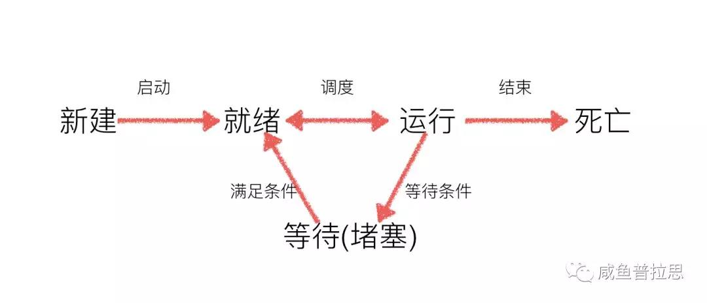

# P ython | Python学习之多线程详解

##### 原创 煌金的咸鱼 咸鱼学Python 2018-06-29 22:52

### 多进程详解

#### 在Python中如何创建多线程？

> 通过Thread创建多线程

> 通过Thread子类创建多线程

python的threading模块是对thread做了一些包装的，可以更加方便的被使用，线程的方法和进程的基本相似，这里不多赘述，下面举几个栗子：

	#例一线程的基本用法
	#coding=utf-8
	import threading
	import time
	def xianyu():
	    print("咸鱼普拉思")
	    time.sleep(1)
	if __name__ == "__main__":
	    for i in range(5):
	        t = threading.Thread(target=xianyu)
	        t.start() #启动线程，即让线程开始执行
	输出：
	咸鱼普拉思
	咸鱼普拉思
	咸鱼普拉思
	咸鱼普拉思
	咸鱼普拉思
	[Finished in 1.1s]
	
	#例二使用Threading子类创建多线程
	#coding=utf-8
	import threading
	import time
	class MyThread(threading.Thread):
	    def run(self):
	        for i in range(3):
	            time.sleep(1)
	            msg = "I'm "+self.name+' @ '+str(i)
	            print(msg)
	def test():
	    for i in range(5):
	        t = MyThread()
	        t.start()
	if __name__ == '__main__':
	    test()
	输出：
	I'm Thread-1 @ 0
	I'm Thread-2 @ 0
	I'm Thread-3 @ 0
	I'm Thread-4 @ 0
	I'm Thread-5 @ 0
	I'm Thread-1 @ 1
	I'm Thread-2 @ 1
	I'm Thread-4 @ 1
	I'm Thread-3 @ 1
	I'm Thread-5 @ 1
	I'm Thread-1 @ 2
	I'm Thread-2 @ 2
	I'm Thread-5 @ 2
	I'm Thread-4 @ 2
	I'm Thread-3 @ 2
	[Finished in 3.2s]

#### 多线程和多进程的执行有什么区别？

> 1.多进程是多份程序同时执行  
> 2.多线程是在一份程序下多个执行指针同时执行   
> 3.多线程并不需要线程间通信，线程间共享全局变量，进程间不共享全局变量   
> 4.进程是系统进行资源分配和调度的一个独立单位，线程是进程的一个实体，是CPU调度和分派的基本单位,它是比进程更小的能独立运行的基本单位。线程自己基本上不拥有系统资源,只拥有一点在运行中必不可少的资源(如程序计数器，一组寄存器和栈)，但是它可与同属一个进程的其他的线程共享进程所拥有的全部资源。             
> 5.线程的划分尺度小于进程(资源比进程少)，使得多线程程序的并发性高。         
> 6.进程在执行过程中拥有独立的内存单元，而多个线程共享内存，从而极大地提高了程序的运行效率                     
> 7.且线程不能够独立执行，必须依存在进程中           
> 8.线程执行开销小，但不利于资源的管理和保护，而进程正相反             

#### 线程的几种状态

线程在执行过程中，如果中途执行sleep语句时，线程会进入到阻塞状态，当sleep结束之后，线程进入就绪状态，等待调度而线程调度将自行选择一个线程执行 。
具体线程状态变换参照下图：

#### 线程之间共享全局变量

举个栗子：
	from threading import Thread
	import time
	num = 100
	def work1():
	    global num
	    for i in range(3):
	        num += 1
	    print("----in work1, num is %d---"%num)
	def work2():
	    global num
	    print("----in work2, num is %d---"%num)
	print("---线程创建之前g_num is %d---"%num)
	t1 = Thread(target=work1)
	t1.start()
	#延时一会，保证t1线程中的事情做完
	time.sleep(1)
	t2 = Thread(target=work2)
	t2.start()
	输出：
	---线程创建之前g_num is 100---
	----in work1, num is 103---
	----in work2, num is 103---
	[Finished in 1.1s]

总结：

> 1.在一个进程内的所有线程共享全局变量，能够在不适用其他方式的前提下完成多线程之间的数据共享（这点要比多进程要好）

> 2.缺点就是，线程是对全局变量随意遂改可能造成多线程之间对全局变量的混乱（即线程非安全）

#### 什么是线程不安全？

举个栗子：
	from threading import Thread
	import time
	num = 0
	def test1():
	    global num
	    for i in range(1000000):
	        num += 1
	    print("---test1---num=%d"%g_numnum
	def test2():
	    global num
	    for i in range(1000000):
	        num += 1
	    print("---test2---num=%d"%num)
	p1 = Thread(target=test1)
	p1.start()
	# time.sleep(3)
	p2 = Thread(target=test2)
	p2.start()
	print("---num=%d---"%num)
	输出：
	当time.sleep(3)，没有取消屏蔽时
	---num=235159---
	---test1---num=1172632
	---test2---num=1334237
	[Finished in 0.3s]
	当time.sleep(3)，取消屏蔽时
	---test1---num=1000000
	---num=1014670---
	---test2---num=2000000
	[Finished in 3.3s]

上面举的栗子就是线程不安全的现象，具体可以解释为，线程1对数据num进行自增的时候，获取的值是num=0，此时系统把线程1调度为”sleeping”状态 ，而线程2在做同样操作时获取的num值还是为0，同时做自增1的操作，这时在线程2中num的值为1，此时系统把线程2调度为”sleeping”状态，线程1再做自增操作时，num还是刚刚获取到的0，长此往复下去，最终的结果就不是我们所预期的了。

没有控制多个线程对同一资源的访问，对数据造成破坏，使得线程运行的结果不可预期 ，这种现象就是线程不安全。

#### 如何避免线程不安全的现象发生？
当多个线程几乎同时修改某一个共享数据的时候，需要进行同步控制，线程同步能够保证多个线程安全访问竞争资源，最简单的同步机制是引入互斥锁。互斥锁为资源引入一个状态：锁定/非锁定。

某个线程要更改共享数据时，先将其锁定，此时资源的状态为“锁定”，其他线程不能更改；直到该线程释放资源，将资源的状态变成“非锁定”，其他的线程才能再次锁定该资源。互斥锁保证了每次只有一个线程进行写入操作，从而保证了多线程情况下数据的正确性。                

举个栗子：

	from threading import Thread, Lock
	import time
	num = 0
	def test1():
	    global num
	    for i in range(1000000):
	        #True表示堵塞 即如果这个锁在上锁之前已经被上锁了，那么这个线程会在这里一直等待到解锁为止 
	        #False表示非堵塞，即不管本次调用能够成功上锁，都不会卡在这,而是继续执行下面的代码
	        mutexFlag = mutex.acquire(True) 
	        if mutexFlag:
	            num += 1
	            mutex.release()
	    print("---test1---num=%d"%num)
	def test2():
	    global num
	    for i in range(1000000):
	        mutexFlag = mutex.acquire(True) #True表示堵塞
	        if mutexFlag:
	            num += 1
	            mutex.release()
	    print("---test2---num=%d"%num)
	#创建一个互斥锁
	#这个所默认是未上锁的状态
	mutex = Lock()
	p1 = Thread(target=test1)
	p1.start()
	p2 = Thread(target=test2)
	p2.start()
	print("---num=%d---"%num)
	输出：
	---num=61866---
	---test1---num=1861180
	---test2---num=2000000

​        当一个线程调用锁的acquire()方法获得锁时，锁就进入“locked”状态。每次只有一个线程可以获得锁。如果此时另一个线程试图获得这个锁，该线程就会变为“blocked”状态，称为“阻塞”，直到拥有锁的线程调用锁的release()方法释放锁之后，锁进入“unlocked”状态。线程调度程序从处于同步阻塞状态的线程中选择一个来获得锁，并使得该线程进入运行状态。

​        加锁确保了某段关键代码只能由一个线程从头到尾完整地执行，但是阻止了多线程并发执行，包含锁的某段代码实际上只能以单线程模式执行，效率就大大地下降了，由于可以存在多个锁，不同的线程持有不同的锁，并试图获取对方持有的锁时，可能会造成死锁

#### 什么是死锁?

在线程间共享多个资源的时候，如果两个线程分别占有一部分资源并且同时等待对方的资源，就会造成死锁。

举个栗子：
	#coding=utf-8
	import threading
	import time
	
	class MyThread1(threading.Thread):
	    def run(self):
	        if mutexA.acquire():
	            print(self.name+'----do1---up----')
	            time.sleep(1)
	
	            if mutexB.acquire():
	                print(self.name+'----do1---down----')
	                mutexB.release()
	            mutexA.release()
	
	class MyThread2(threading.Thread):
	    def run(self):
	        if mutexB.acquire():
	            print(self.name+'----do2---up----')
	            time.sleep(1)
	            if mutexA.acquire():
	                print(self.name+'----do2---down----')
	                mutexA.release()
	            mutexB.release()
	
	mutexA = threading.Lock()
	mutexB = threading.Lock()
	
	if __name__ == '__main__':
	    t1 = MyThread1()
	    t2 = MyThread2()
	    t1.start()
	    t2.start()

#### 生产者与消费者模型

可以通过生产者和消费者模型来解决线程的同步，和线程安全。

Python的Queue模块中提供了同步的、线程安全的队列类，包括FIFO（先入先出)队列Queue，LIFO（后入先出）队列LifoQueue，和优先级队列PriorityQueue。这些队列都实现了锁原语（可以理解为原子操作，即要么不做，要么就做完），能够在多线程中直接使用，可以使用队列来实现线程间的同步。

举个栗子：
	#encoding=utf-8
	import threading
	import time
	
	#python2中
	# from Queue import Queue
	#python3中
	from queue import Queue
	class Producer(threading.Thread):
	    def run(self):
	        global queue
	        count = 0
	        while True:
	            if queue.qsize() < 1000:
	                for i in range(100):
	                    count = count +1
	                    msg = '生成产品'+str(count)
	                    queue.put(msg)
	                    print(msg)
	            time.sleep(0.5)
	class Consumer(threading.Thread):
	    def run(self):
	        global queue
	        while True:
	            if queue.qsize() > 100:
	                for i in range(3):
	                    msg = self.name + '消费了 '+queue.get()
	                    print(msg)
	            time.sleep(1)
	if __name__ == '__main__':
	    queue = Queue()
	    for i in range(500):
	        queue.put('初始产品'+str(i))
	    for i in range(2):
	        p = Producer()
	        p.start(),
	    for i in range(5):
	        c = Consumer()
	        c.start()

#### 什么是生产者与消费者模型？

生产者消费者模式是通过一个容器来解决生产者和消费者的强耦合问题。生产者和消费者彼此之间不直接通讯，而通过阻塞队列来进行通讯，所以生产者生产完数据之后不用等待消费者处理，直接扔给阻塞队列，消费者不找生产者要数据，而是直接从阻塞队列里取，阻塞队列就相当于一个缓冲区，平衡了生产者和消费者的处理能力。这个阻塞队列就是用来给生产者和消费者解耦的。纵观大多数设计模式，都会找一个第三者出来进行解耦。

#### 想使用全局变量有不想加锁怎么办？

在多线程环境下，每个线程都有自己的数据。一个线程使用自己的局部变量比使用全局变量好，因为局部变量只有线程自己能看见，不会影响其他线程，而全局变量的修改必须加锁。

举个栗子：
	import threading
	# 创建全局ThreadLocal对象:
	local_school = threading.local()
	def process_student():
	    # 获取当前线程关联的student:
	    std = local_school.student
	    print('Hello, %s (in %s)' % (std, threading.current_thread().name))
	def process_thread(name):
	    # 绑定ThreadLocal的student:
	    local_school.student = name
	    process_student()
	t1 = threading.Thread(target= process_thread, args=('咸鱼',), name='Thread-A')
	t2 = threading.Thread(target= process_thread, args=('普拉思',), name='Thread-B')
	t1.start()
	t2.start()
	t1.join()
	t2.join()
	输出：
	Hello, 咸鱼 (in Thread-A)
	Hello, 普拉思 (in Thread-B)

全局变量local_school就是一个ThreadLocal对象，每个Thread对它都可以读写student属性，但互不影响。你可以把local_school看成全局变量，但每个属性如local_school.student都是线程的局部变量，可以任意读写而互不干扰，也不用管理锁的问题，ThreadLocal内部会处理。
可以理解为全局变量local_school是一个dict，不但可以用local_school.student，还可以绑定其他变量，如local_school.teacher等等。
ThreadLocal最常用的地方就是为每个线程绑定一个数据库连接，HTTP请求，用户身份信息等，这样一个线程的所有调用到的处理函数都可以非常方便地访问这些资源。
一个ThreadLocal变量虽然是全局变量，但每个线程都只能读写自己线程的独立副本，互不干扰。ThreadLocal解决了参数在一个线程中各个函数之间互相传递的问题

#### 同步调用和异步调用？

> 同步调用就是你喊你朋友吃饭，你朋友在忙，你就一直在那等，等你朋友忙完了 ，你们一起去。
> 异步调用就是你喊你朋友吃饭，你朋友说知道了，待会忙完去找你 ，你就去做别的了。

举个栗子：
	from multiprocessing import Pool
	import time
	import os
	def test():
	    print("---进程池中的进程---pid=%d,ppid=%d--"%(os.getpid(),os.getppid()))
	    for i in range(3):
	        print("----%d---"%i)
	        time.sleep(1)
	    return "hahah"
	def test2(args):
	    print("---callback func--pid=%d"%os.getpid())
	    print("---callback func--args=%s"%args)
	pool = Pool(3)
	pool.apply_async(func=test,callback=test2)
	time.sleep(5)
	print("----主进程-pid=%d----"%os.getpid())
	输出：
	---进程池中的进程---pid=9401,ppid=9400--
	----0---
	----1---
	----2---
	---callback func--pid=9400
	---callback func--args=hahah
	----主进程-pid=9400----

注意：这里的callback是由主进程执行的，当子进程死亡，主进程回调函数。

#### 什么是GIL锁？

Python全局解释锁（GIL）简单来说就是一个互斥体（或者说锁），这样的机制只允许一个线程来控制Python解释器。这就意味着在任何一个时间点只有一个线程处于执行状态。
所以在python中多线程是假的，因为在执行过程中CPU中只有一个线程在执行。
当你使用多进程时，你的效率是高于多线程的。
Python GIL经常被认为是一个神秘而困难的话题，但是请记住作为一名Python支持者，只有当您正在编写C扩展或者您的程序中有计算密集型的多线程任务时才会被GIL影响。
