## 逆向目标

+ 目标：<code>某加速商城登录接口</code>
+ 主页：<code>aHR0cDovL3d3dy4xNXl1bm1hbGwuY29tL3BjL2xvZ2luL2luZGV4</code>

+ 参数：

~~~ tex
这里一共有三个参数需要逆向：
cookie
经过加密了的password
_csrfToken
~~~

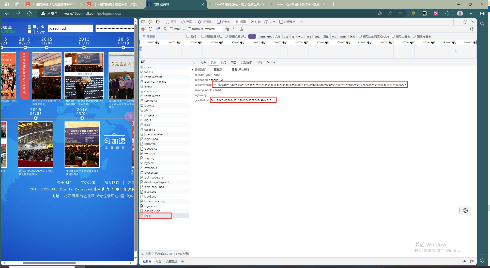

## 逆向过程

### 抓包分析

在首页随便输入一个账号密码登陆，然后抓包定位到登录接口为<code>http://www.15yunmall.com/pc/login/check</code>.POST 请求，Form Data 里，密码 `u[password]` 被加密处理了，此外还有一个 `_csrfToken` 也是需要我们解决的，cookie 里面有一个 `PHPSESSID`，经过测试，如果不带此参数，最终的请求也是失败的。

### 参数逆向

+ 首先看看 `_csrfToken`，先尝试直接搜索一下它的值，可以发现其实在首页的源码里面就有，直接匹配拿过来即可：

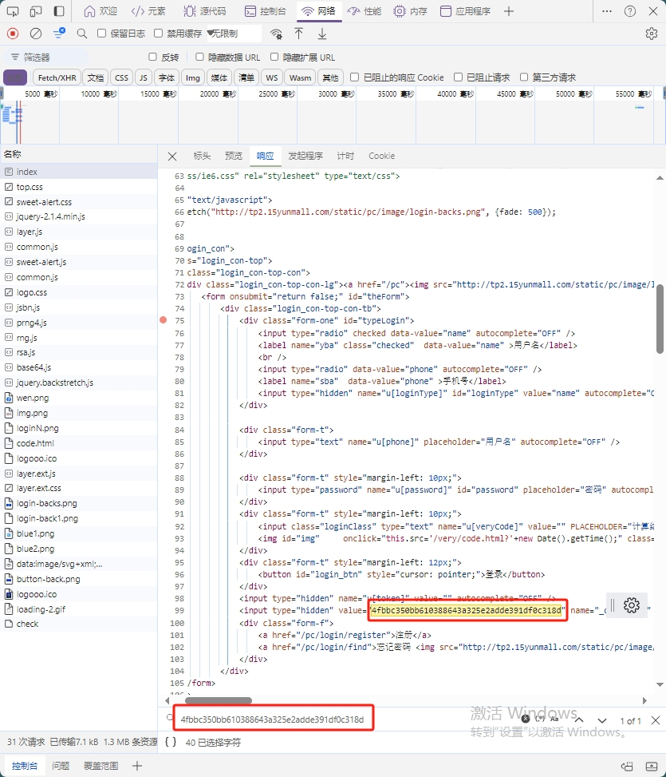

+ 再看一下 cookie 里面的 PHPSESSID，首先想到的，可能是第一次访问页面，Response Headers 返回的 Set-Cookie 得到的，查看第一次请求，确实是的，如果没有的话，需要清除缓存再访问（开发者工具 ——> Application ——> Storage ——> Clear site data）。
  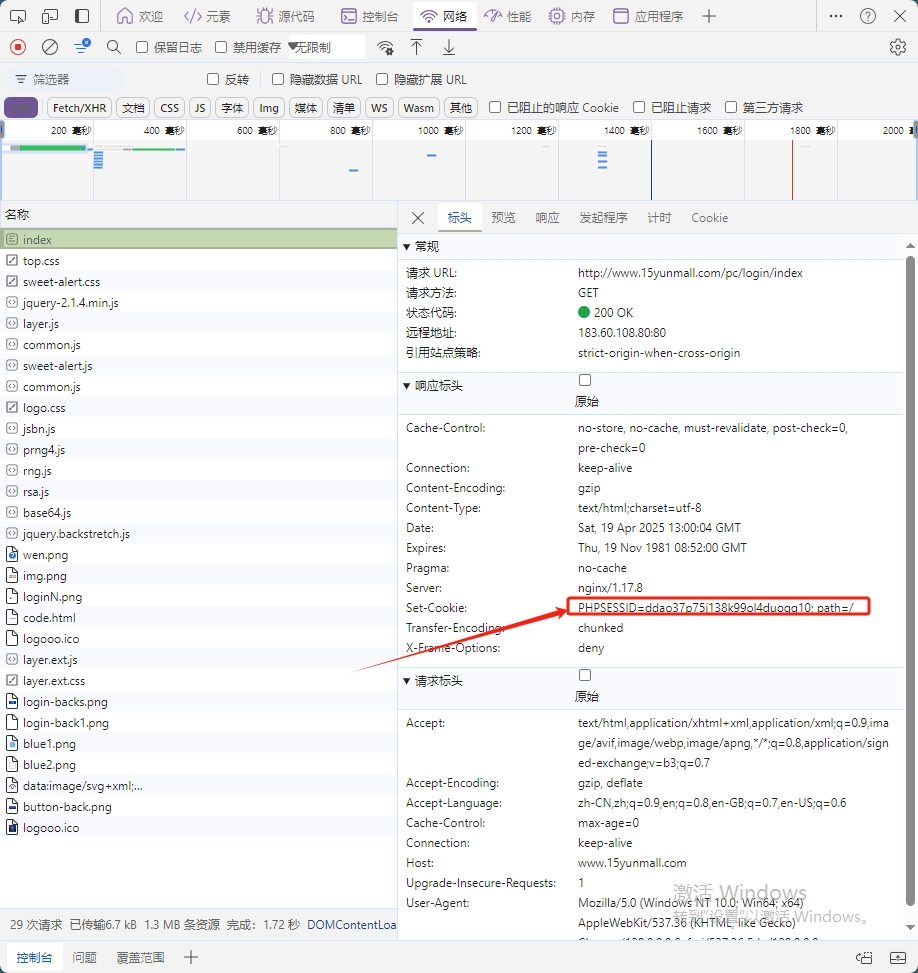

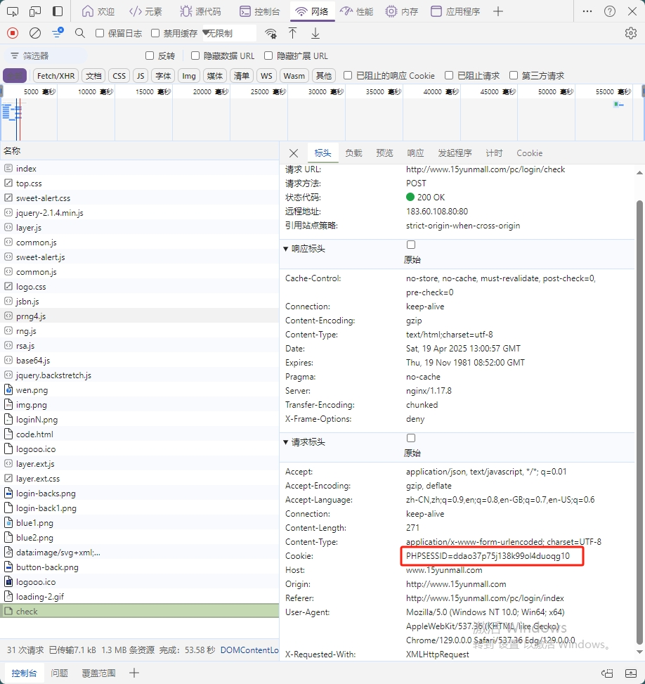

+ 最后一个密码参数 `u[password]`，肯定是通过 JS 加密得到的，直接 Ctrl+Shift+F 全局搜索，可以直接在 index 首页找到 [RSA](https://so.csdn.net/so/search?q=RSA&spm=1001.2101.3001.7020) 加密的地方，埋下断点进行调试，最后的 res 正是加密后的密码：

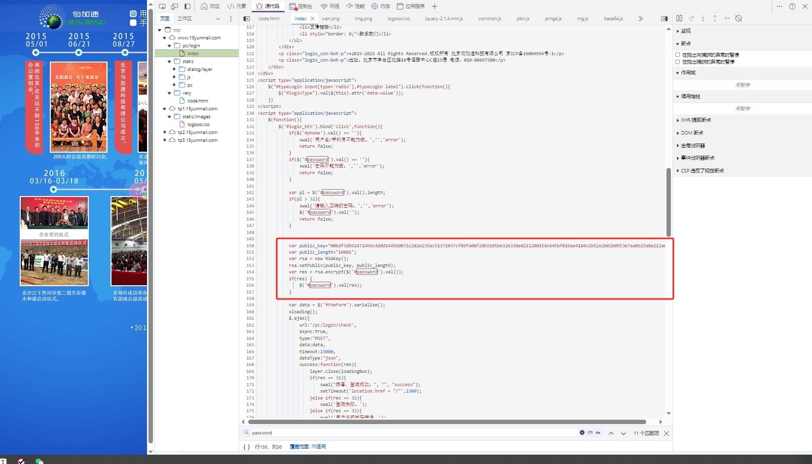

将这段关键代码进行改写，封装成一个函数：

~~~ javascript
function getEncryptedPassword(password){
	var public_key="00bdf3db924714b9c4ddd144910071c282e235ac51371037cf89fa08f28b9105b6326338ed211280154c645bf81bae4184c2b52e2b02b0953e7aa8b25a8e212a0b";
	var public_length="10001";
	var rsa = new RSAKey();
	rsa.setPublic(public_key, public_length);
	return(rsa.encrypt(password));
}
~~~

这里主要用到的三个函数 `RSAKey()`、`setPublic()`、`encrypt()`，在开发者工具中，鼠标放到函数上，可以看到这里都是调用的 rsa.js 里面的方法，我们直接将整个文件剥离下来进行本地调试：

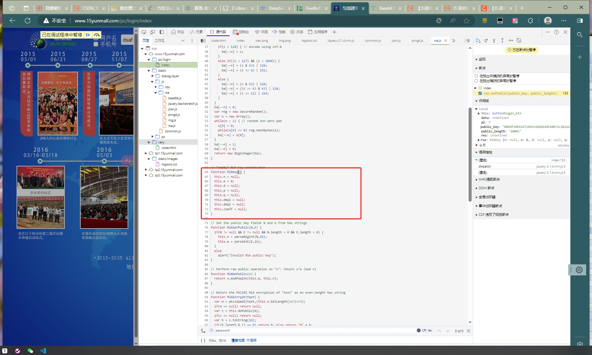

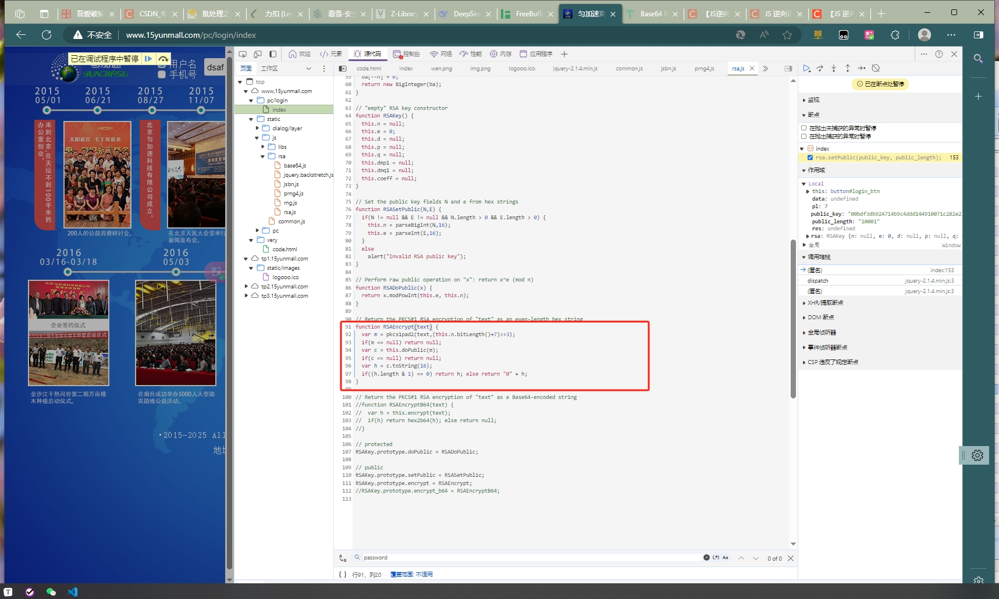

本地调试会发现提示 BigInteger 未定义，鼠标移到这个函数上面，可以发现是调用了 jsbn.js 里面的方法，同样的，直接将整个 jsbn.js 文件剥离下来进行本地调试。

这里其实在 rsa.js 文件的第一行有一句注释：// Depends on jsbn.js and rng.js，我们可以猜测 rsa.js 是可能依赖 jsbn.js 和 rng.js 这两个文件的。

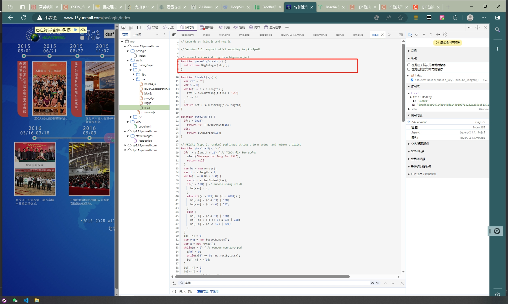

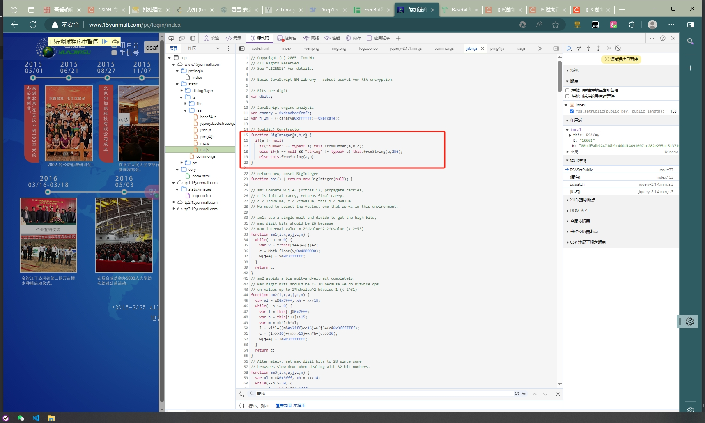

有了 jsbn.js 的代码，再次进行调试，会发现又提示 navigator 和 SecureRandom 未定义，navigator 我们已经非常熟悉了，是浏览器的相关信息，一般情况下直接定义为空即可（navigator = {};）；将鼠标移到 SecureRandom 函数上面，可以发现是调用了 rng.js 里面的方法，同样的，直接将整个 rng.js 文件剥离下来进行本地调试。这里就证实了前面我们的猜想，rsa.js 确实是依赖 jsbn.js 和 rng.js 的。

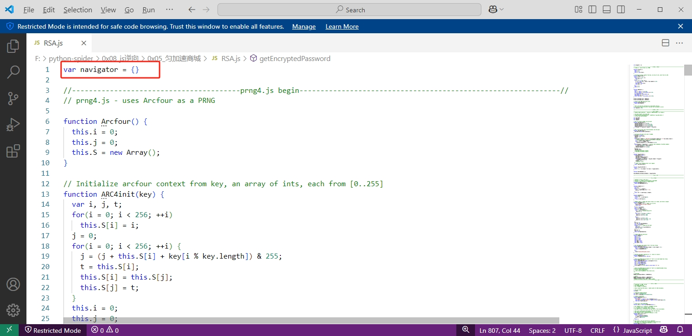

`

另外注意到，这里在 rng.js 文件的第一行，同样有一句注释：// Random number generator - requires a PRNG backend, e.g. prng4.js，表明 rng.js 是随机数生成器，需要 PRNG 后端，例如 prng4.js，在密码学中，PRNG 全称是 pseudorandom number generator，即伪随机数生成器，是指通过特定算法生成一系列的数字，使得这一系列的数字看起来是随机的，但是实际是确定的，所以叫伪随机数，感兴趣的朋友可以深入研究一下，在这里我们知道 rng.js 可能还依赖于 prng4.js，需要进一步调试才清楚。

rsa.js、jsbn.js、rng.js 都齐全了，再次本地调试，会发现 rng.js 里面的 rng_psize 未定义，鼠标放上去看到 rng_psize 就是一个定值 256，在右边的 Global 全局变量里也可以看到值为 256，尝试搜索一下 rng_psize，可以发现在 prng4.js 里面有定义 var rng_psize = 256;，果然和注释说得一样，rng.js 是依赖 prng4.js 的，我们也直接将整个 prng4.js 文件剥离下来进行本地调试。

再次调试，运行无误，可以成功拿到加密后的密码了：

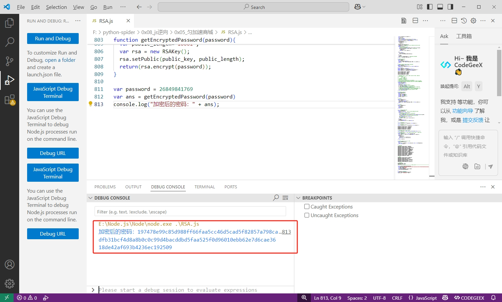

### 逻辑总结

1. 加密入口可以在 index 首页找到，用到了 rsa.js 里面的三个加密函数 RSAKey()、setPublic()、encrypt()；

2. rsa.js 里的 BigInteger() 函数依赖 jsbn.js，SecureRandom() 函数依赖 rng.js；

3. rng.js 里的变量 rng_psize 在 prng4.js 中定义，prng_newstate() 函数也依赖 prng4.js；

要将 rsa.js、jsbn.js、rng.js、prng4.js 这四个 JS 加密文件完整的剥离下来才能还原整个加密过程。

## 逆向代码

### 参数 JS 加密代码

~~~ javascript
var navigator = {}

//----------------------------------------prng4.js begin--------------------------------------------------------------//
// prng4.js - uses Arcfour as a PRNG

function Arcfour() {
  this.i = 0;
  this.j = 0;
  this.S = new Array();
}

// Initialize arcfour context from key, an array of ints, each from [0..255]
function ARC4init(key) {
  var i, j, t;
  for(i = 0; i < 256; ++i)
    this.S[i] = i;
  j = 0;
  for(i = 0; i < 256; ++i) {
    j = (j + this.S[i] + key[i % key.length]) & 255;
    t = this.S[i];
    this.S[i] = this.S[j];
    this.S[j] = t;
  }
  this.i = 0;
  this.j = 0;
}

function ARC4next() {
  var t;
  this.i = (this.i + 1) & 255;
  this.j = (this.j + this.S[this.i]) & 255;
  t = this.S[this.i];
  this.S[this.i] = this.S[this.j];
  this.S[this.j] = t;
  return this.S[(t + this.S[this.i]) & 255];
}

Arcfour.prototype.init = ARC4init;
Arcfour.prototype.next = ARC4next;

// Plug in your RNG constructor here
function prng_newstate() {
  return new Arcfour();
}

// Pool size must be a multiple of 4 and greater than 32.
// An array of bytes the size of the pool will be passed to init()
var rng_psize = 256;

//----------------------------------------prng4.js end---------------------------------------------------------------//

//----------------------------------------rng.js begin--------------------------------------------------------------//
// Random number generator - requires a PRNG backend, e.g. prng4.js

// For best results, put code like
// <body onClick='rng_seed_time();' onKeyPress='rng_seed_time();'>
// in your main HTML document.

var rng_state;
var rng_pool;
var rng_pptr;

// Mix in a 32-bit integer into the pool
function rng_seed_int(x) {
  rng_pool[rng_pptr++] ^= x & 255;
  rng_pool[rng_pptr++] ^= (x >> 8) & 255;
  rng_pool[rng_pptr++] ^= (x >> 16) & 255;
  rng_pool[rng_pptr++] ^= (x >> 24) & 255;
  if(rng_pptr >= rng_psize) rng_pptr -= rng_psize;
}

// Mix in the current time (w/milliseconds) into the pool
function rng_seed_time() {
  rng_seed_int(new Date().getTime());
}

// Initialize the pool with junk if needed.
if(rng_pool == null) {
  rng_pool = new Array();
  rng_pptr = 0;
  var t;
  if(navigator.appName == "Netscape" && navigator.appVersion < "5" && window.crypto) {
    // Extract entropy (256 bits) from NS4 RNG if available
    var z = window.crypto.random(32);
    for(t = 0; t < z.length; ++t)
      rng_pool[rng_pptr++] = z.charCodeAt(t) & 255;
  }  
  while(rng_pptr < rng_psize) {  // extract some randomness from Math.random()
    t = Math.floor(65536 * Math.random());
    rng_pool[rng_pptr++] = t >>> 8;
    rng_pool[rng_pptr++] = t & 255;
  }
  rng_pptr = 0;
  rng_seed_time();
  //rng_seed_int(window.screenX);
  //rng_seed_int(window.screenY);
}

function rng_get_byte() {
  if(rng_state == null) {
    rng_seed_time();
    rng_state = prng_newstate();
    rng_state.init(rng_pool);
    for(rng_pptr = 0; rng_pptr < rng_pool.length; ++rng_pptr)
      rng_pool[rng_pptr] = 0;
    rng_pptr = 0;
    //rng_pool = null;
  }
  // TODO: allow reseeding after first request
  return rng_state.next();
}

function rng_get_bytes(ba) {
  var i;
  for(i = 0; i < ba.length; ++i) ba[i] = rng_get_byte();
}

function SecureRandom() {}

SecureRandom.prototype.nextBytes = rng_get_bytes;

//-----------------------------------------rng.js end--------------------------------------------------------------//

// -----------------------------------rsa.js begin--------------------------------------------------------------//

// Depends on jsbn.js and rng.js
// Version 1.1: support utf-8 encoding in pkcs1pad2
// convert a (hex) string to a bignum object
function parseBigInt(str,r) {
  return new BigInteger(str,r);
}

function linebrk(s,n) {
  var ret = "";
  var i = 0;
  while(i + n < s.length) {
    ret += s.substring(i,i+n) + "\n";
    i += n;
  }
  return ret + s.substring(i,s.length);
}

function byte2Hex(b) {
  if(b < 0x10)
    return "0" + b.toString(16);
  else
    return b.toString(16);
}

// PKCS#1 (type 2, random) pad input string s to n bytes, and return a bigint
function pkcs1pad2(s,n) {
  if(n < s.length + 11) { // TODO: fix for utf-8
    alert("Message too long for RSA");
    return null;
  }
  var ba = new Array();
  var i = s.length - 1;
  while(i >= 0 && n > 0) {
    var c = s.charCodeAt(i--);
    if(c < 128) { // encode using utf-8
      ba[--n] = c;
    }
    else if((c > 127) && (c < 2048)) {
      ba[--n] = (c & 63) | 128;
      ba[--n] = (c >> 6) | 192;
    }
    else {
      ba[--n] = (c & 63) | 128;
      ba[--n] = ((c >> 6) & 63) | 128;
      ba[--n] = (c >> 12) | 224;
    }
  }
  ba[--n] = 0;
  var rng = new SecureRandom();
  var x = new Array();
  while(n > 2) { // random non-zero pad
    x[0] = 0;
    while(x[0] == 0) rng.nextBytes(x);
    ba[--n] = x[0];
  }
  ba[--n] = 2;
  ba[--n] = 0;
  return new BigInteger(ba);
}

// "empty" RSA key constructor
function RSAKey() {
  this.n = null;
  this.e = 0;
  this.d = null;
  this.p = null;
  this.q = null;
  this.dmp1 = null;
  this.dmq1 = null;
  this.coeff = null;
}

// Set the public key fields N and e from hex strings
function RSASetPublic(N,E) {
  if(N != null && E != null && N.length > 0 && E.length > 0) {
    this.n = parseBigInt(N,16);
    this.e = parseInt(E,16);
  }
  else
    alert("Invalid RSA public key");
}

// Perform raw public operation on "x": return x^e (mod n)
function RSADoPublic(x) {
  return x.modPowInt(this.e, this.n);
}

// Return the PKCS#1 RSA encryption of "text" as an even-length hex string
function RSAEncrypt(text) {
  var m = pkcs1pad2(text,(this.n.bitLength()+7)>>3);
  if(m == null) return null;
  var c = this.doPublic(m);
  if(c == null) return null;
  var h = c.toString(16);
  if((h.length & 1) == 0) return h; else return "0" + h;
}

// Return the PKCS#1 RSA encryption of "text" as a Base64-encoded string
//function RSAEncryptB64(text) {
//  var h = this.encrypt(text);
//  if(h) return hex2b64(h); else return null;
//}

// protected
RSAKey.prototype.doPublic = RSADoPublic;

// public
RSAKey.prototype.setPublic = RSASetPublic;
RSAKey.prototype.encrypt = RSAEncrypt;
//RSAKey.prototype.encrypt_b64 = RSAEncryptB64;
//--------------------------------------------rsa.js end--------------------------------------------------------//

//------------------------------------jsbn.js begin-------------------------------------------------------------//
// Copyright (c) 2005  Tom Wu
// All Rights Reserved.
// See "LICENSE" for details.

// Basic JavaScript BN library - subset useful for RSA encryption.

// Bits per digit
var dbits;

// JavaScript engine analysis
var canary = 0xdeadbeefcafe;
var j_lm = ((canary&0xffffff)==0xefcafe);

// (public) Constructor
function BigInteger(a,b,c) {
  if(a != null)
    if("number" == typeof a) this.fromNumber(a,b,c);
    else if(b == null && "string" != typeof a) this.fromString(a,256);
    else this.fromString(a,b);
}

// return new, unset BigInteger
function nbi() { return new BigInteger(null); }

// am: Compute w_j += (x*this_i), propagate carries,
// c is initial carry, returns final carry.
// c < 3*dvalue, x < 2*dvalue, this_i < dvalue
// We need to select the fastest one that works in this environment.

// am1: use a single mult and divide to get the high bits,
// max digit bits should be 26 because
// max internal value = 2*dvalue^2-2*dvalue (< 2^53)
function am1(i,x,w,j,c,n) {
  while(--n >= 0) {
    var v = x*this[i++]+w[j]+c;
    c = Math.floor(v/0x4000000);
    w[j++] = v&0x3ffffff;
  }
  return c;
}
// am2 avoids a big mult-and-extract completely.
// Max digit bits should be <= 30 because we do bitwise ops
// on values up to 2*hdvalue^2-hdvalue-1 (< 2^31)
function am2(i,x,w,j,c,n) {
  var xl = x&0x7fff, xh = x>>15;
  while(--n >= 0) {
    var l = this[i]&0x7fff;
    var h = this[i++]>>15;
    var m = xh*l+h*xl;
    l = xl*l+((m&0x7fff)<<15)+w[j]+(c&0x3fffffff);
    c = (l>>>30)+(m>>>15)+xh*h+(c>>>30);
    w[j++] = l&0x3fffffff;
  }
  return c;
}
// Alternately, set max digit bits to 28 since some
// browsers slow down when dealing with 32-bit numbers.
function am3(i,x,w,j,c,n) {
  var xl = x&0x3fff, xh = x>>14;
  while(--n >= 0) {
    var l = this[i]&0x3fff;
    var h = this[i++]>>14;
    var m = xh*l+h*xl;
    l = xl*l+((m&0x3fff)<<14)+w[j]+c;
    c = (l>>28)+(m>>14)+xh*h;
    w[j++] = l&0xfffffff;
  }
  return c;
}
if(j_lm && (navigator.appName == "Microsoft Internet Explorer")) {
  BigInteger.prototype.am = am2;
  dbits = 30;
}
else if(j_lm && (navigator.appName != "Netscape")) {
  BigInteger.prototype.am = am1;
  dbits = 26;
}
else { // Mozilla/Netscape seems to prefer am3
  BigInteger.prototype.am = am3;
  dbits = 28;
}

BigInteger.prototype.DB = dbits;
BigInteger.prototype.DM = ((1<<dbits)-1);
BigInteger.prototype.DV = (1<<dbits);

var BI_FP = 52;
BigInteger.prototype.FV = Math.pow(2,BI_FP);
BigInteger.prototype.F1 = BI_FP-dbits;
BigInteger.prototype.F2 = 2*dbits-BI_FP;

// Digit conversions
var BI_RM = "0123456789abcdefghijklmnopqrstuvwxyz";
var BI_RC = new Array();
var rr,vv;
rr = "0".charCodeAt(0);
for(vv = 0; vv <= 9; ++vv) BI_RC[rr++] = vv;
rr = "a".charCodeAt(0);
for(vv = 10; vv < 36; ++vv) BI_RC[rr++] = vv;
rr = "A".charCodeAt(0);
for(vv = 10; vv < 36; ++vv) BI_RC[rr++] = vv;

function int2char(n) { return BI_RM.charAt(n); }
function intAt(s,i) {
  var c = BI_RC[s.charCodeAt(i)];
  return (c==null)?-1:c;
}

// (protected) copy this to r
function bnpCopyTo(r) {
  for(var i = this.t-1; i >= 0; --i) r[i] = this[i];
  r.t = this.t;
  r.s = this.s;
}

// (protected) set from integer value x, -DV <= x < DV
function bnpFromInt(x) {
  this.t = 1;
  this.s = (x<0)?-1:0;
  if(x > 0) this[0] = x;
  else if(x < -1) this[0] = x+DV;
  else this.t = 0;
}

// return bigint initialized to value
function nbv(i) { var r = nbi(); r.fromInt(i); return r; }

// (protected) set from string and radix
function bnpFromString(s,b) {
  var k;
  if(b == 16) k = 4;
  else if(b == 8) k = 3;
  else if(b == 256) k = 8; // byte array
  else if(b == 2) k = 1;
  else if(b == 32) k = 5;
  else if(b == 4) k = 2;
  else { this.fromRadix(s,b); return; }
  this.t = 0;
  this.s = 0;
  var i = s.length, mi = false, sh = 0;
  while(--i >= 0) {
    var x = (k==8)?s[i]&0xff:intAt(s,i);
    if(x < 0) {
      if(s.charAt(i) == "-") mi = true;
      continue;
    }
    mi = false;
    if(sh == 0)
      this[this.t++] = x;
    else if(sh+k > this.DB) {
      this[this.t-1] |= (x&((1<<(this.DB-sh))-1))<<sh;
      this[this.t++] = (x>>(this.DB-sh));
    }
    else
      this[this.t-1] |= x<<sh;
    sh += k;
    if(sh >= this.DB) sh -= this.DB;
  }
  if(k == 8 && (s[0]&0x80) != 0) {
    this.s = -1;
    if(sh > 0) this[this.t-1] |= ((1<<(this.DB-sh))-1)<<sh;
  }
  this.clamp();
  if(mi) BigInteger.ZERO.subTo(this,this);
}

// (protected) clamp off excess high words
function bnpClamp() {
  var c = this.s&this.DM;
  while(this.t > 0 && this[this.t-1] == c) --this.t;
}

// (public) return string representation in given radix
function bnToString(b) {
  if(this.s < 0) return "-"+this.negate().toString(b);
  var k;
  if(b == 16) k = 4;
  else if(b == 8) k = 3;
  else if(b == 2) k = 1;
  else if(b == 32) k = 5;
  else if(b == 4) k = 2;
  else return this.toRadix(b);
  var km = (1<<k)-1, d, m = false, r = "", i = this.t;
  var p = this.DB-(i*this.DB)%k;
  if(i-- > 0) {
    if(p < this.DB && (d = this[i]>>p) > 0) { m = true; r = int2char(d); }
    while(i >= 0) {
      if(p < k) {
        d = (this[i]&((1<<p)-1))<<(k-p);
        d |= this[--i]>>(p+=this.DB-k);
      }
      else {
        d = (this[i]>>(p-=k))&km;
        if(p <= 0) { p += this.DB; --i; }
      }
      if(d > 0) m = true;
      if(m) r += int2char(d);
    }
  }
  return m?r:"0";
}

// (public) -this
function bnNegate() { var r = nbi(); BigInteger.ZERO.subTo(this,r); return r; }

// (public) |this|
function bnAbs() { return (this.s<0)?this.negate():this; }

// (public) return + if this > a, - if this < a, 0 if equal
function bnCompareTo(a) {
  var r = this.s-a.s;
  if(r != 0) return r;
  var i = this.t;
  r = i-a.t;
  if(r != 0) return r;
  while(--i >= 0) if((r=this[i]-a[i]) != 0) return r;
  return 0;
}

// returns bit length of the integer x
function nbits(x) {
  var r = 1, t;
  if((t=x>>>16) != 0) { x = t; r += 16; }
  if((t=x>>8) != 0) { x = t; r += 8; }
  if((t=x>>4) != 0) { x = t; r += 4; }
  if((t=x>>2) != 0) { x = t; r += 2; }
  if((t=x>>1) != 0) { x = t; r += 1; }
  return r;
}

// (public) return the number of bits in "this"
function bnBitLength() {
  if(this.t <= 0) return 0;
  return this.DB*(this.t-1)+nbits(this[this.t-1]^(this.s&this.DM));
}

// (protected) r = this << n*DB
function bnpDLShiftTo(n,r) {
  var i;
  for(i = this.t-1; i >= 0; --i) r[i+n] = this[i];
  for(i = n-1; i >= 0; --i) r[i] = 0;
  r.t = this.t+n;
  r.s = this.s;
}

// (protected) r = this >> n*DB
function bnpDRShiftTo(n,r) {
  for(var i = n; i < this.t; ++i) r[i-n] = this[i];
  r.t = Math.max(this.t-n,0);
  r.s = this.s;
}

// (protected) r = this << n
function bnpLShiftTo(n,r) {
  var bs = n%this.DB;
  var cbs = this.DB-bs;
  var bm = (1<<cbs)-1;
  var ds = Math.floor(n/this.DB), c = (this.s<<bs)&this.DM, i;
  for(i = this.t-1; i >= 0; --i) {
    r[i+ds+1] = (this[i]>>cbs)|c;
    c = (this[i]&bm)<<bs;
  }
  for(i = ds-1; i >= 0; --i) r[i] = 0;
  r[ds] = c;
  r.t = this.t+ds+1;
  r.s = this.s;
  r.clamp();
}

// (protected) r = this >> n
function bnpRShiftTo(n,r) {
  r.s = this.s;
  var ds = Math.floor(n/this.DB);
  if(ds >= this.t) { r.t = 0; return; }
  var bs = n%this.DB;
  var cbs = this.DB-bs;
  var bm = (1<<bs)-1;
  r[0] = this[ds]>>bs;
  for(var i = ds+1; i < this.t; ++i) {
    r[i-ds-1] |= (this[i]&bm)<<cbs;
    r[i-ds] = this[i]>>bs;
  }
  if(bs > 0) r[this.t-ds-1] |= (this.s&bm)<<cbs;
  r.t = this.t-ds;
  r.clamp();
}

// (protected) r = this - a
function bnpSubTo(a,r) {
  var i = 0, c = 0, m = Math.min(a.t,this.t);
  while(i < m) {
    c += this[i]-a[i];
    r[i++] = c&this.DM;
    c >>= this.DB;
  }
  if(a.t < this.t) {
    c -= a.s;
    while(i < this.t) {
      c += this[i];
      r[i++] = c&this.DM;
      c >>= this.DB;
    }
    c += this.s;
  }
  else {
    c += this.s;
    while(i < a.t) {
      c -= a[i];
      r[i++] = c&this.DM;
      c >>= this.DB;
    }
    c -= a.s;
  }
  r.s = (c<0)?-1:0;
  if(c < -1) r[i++] = this.DV+c;
  else if(c > 0) r[i++] = c;
  r.t = i;
  r.clamp();
}

// (protected) r = this * a, r != this,a (HAC 14.12)
// "this" should be the larger one if appropriate.
function bnpMultiplyTo(a,r) {
  var x = this.abs(), y = a.abs();
  var i = x.t;
  r.t = i+y.t;
  while(--i >= 0) r[i] = 0;
  for(i = 0; i < y.t; ++i) r[i+x.t] = x.am(0,y[i],r,i,0,x.t);
  r.s = 0;
  r.clamp();
  if(this.s != a.s) BigInteger.ZERO.subTo(r,r);
}

// (protected) r = this^2, r != this (HAC 14.16)
function bnpSquareTo(r) {
  var x = this.abs();
  var i = r.t = 2*x.t;
  while(--i >= 0) r[i] = 0;
  for(i = 0; i < x.t-1; ++i) {
    var c = x.am(i,x[i],r,2*i,0,1);
    if((r[i+x.t]+=x.am(i+1,2*x[i],r,2*i+1,c,x.t-i-1)) >= x.DV) {
      r[i+x.t] -= x.DV;
      r[i+x.t+1] = 1;
    }
  }
  if(r.t > 0) r[r.t-1] += x.am(i,x[i],r,2*i,0,1);
  r.s = 0;
  r.clamp();
}

// (protected) divide this by m, quotient and remainder to q, r (HAC 14.20)
// r != q, this != m.  q or r may be null.
function bnpDivRemTo(m,q,r) {
  var pm = m.abs();
  if(pm.t <= 0) return;
  var pt = this.abs();
  if(pt.t < pm.t) {
    if(q != null) q.fromInt(0);
    if(r != null) this.copyTo(r);
    return;
  }
  if(r == null) r = nbi();
  var y = nbi(), ts = this.s, ms = m.s;
  var nsh = this.DB-nbits(pm[pm.t-1]);	// normalize modulus
  if(nsh > 0) { pm.lShiftTo(nsh,y); pt.lShiftTo(nsh,r); }
  else { pm.copyTo(y); pt.copyTo(r); }
  var ys = y.t;
  var y0 = y[ys-1];
  if(y0 == 0) return;
  var yt = y0*(1<<this.F1)+((ys>1)?y[ys-2]>>this.F2:0);
  var d1 = this.FV/yt, d2 = (1<<this.F1)/yt, e = 1<<this.F2;
  var i = r.t, j = i-ys, t = (q==null)?nbi():q;
  y.dlShiftTo(j,t);
  if(r.compareTo(t) >= 0) {
    r[r.t++] = 1;
    r.subTo(t,r);
  }
  BigInteger.ONE.dlShiftTo(ys,t);
  t.subTo(y,y);	// "negative" y so we can replace sub with am later
  while(y.t < ys) y[y.t++] = 0;
  while(--j >= 0) {
    // Estimate quotient digit
    var qd = (r[--i]==y0)?this.DM:Math.floor(r[i]*d1+(r[i-1]+e)*d2);
    if((r[i]+=y.am(0,qd,r,j,0,ys)) < qd) {	// Try it out
      y.dlShiftTo(j,t);
      r.subTo(t,r);
      while(r[i] < --qd) r.subTo(t,r);
    }
  }
  if(q != null) {
    r.drShiftTo(ys,q);
    if(ts != ms) BigInteger.ZERO.subTo(q,q);
  }
  r.t = ys;
  r.clamp();
  if(nsh > 0) r.rShiftTo(nsh,r);	// Denormalize remainder
  if(ts < 0) BigInteger.ZERO.subTo(r,r);
}

// (public) this mod a
function bnMod(a) {
  var r = nbi();
  this.abs().divRemTo(a,null,r);
  if(this.s < 0 && r.compareTo(BigInteger.ZERO) > 0) a.subTo(r,r);
  return r;
}

// Modular reduction using "classic" algorithm
function Classic(m) { this.m = m; }
function cConvert(x) {
  if(x.s < 0 || x.compareTo(this.m) >= 0) return x.mod(this.m);
  else return x;
}
function cRevert(x) { return x; }
function cReduce(x) { x.divRemTo(this.m,null,x); }
function cMulTo(x,y,r) { x.multiplyTo(y,r); this.reduce(r); }
function cSqrTo(x,r) { x.squareTo(r); this.reduce(r); }

Classic.prototype.convert = cConvert;
Classic.prototype.revert = cRevert;
Classic.prototype.reduce = cReduce;
Classic.prototype.mulTo = cMulTo;
Classic.prototype.sqrTo = cSqrTo;

// (protected) return "-1/this % 2^DB"; useful for Mont. reduction
// justification:
//         xy == 1 (mod m)
//         xy =  1+km
//   xy(2-xy) = (1+km)(1-km)
// x[y(2-xy)] = 1-k^2m^2
// x[y(2-xy)] == 1 (mod m^2)
// if y is 1/x mod m, then y(2-xy) is 1/x mod m^2
// should reduce x and y(2-xy) by m^2 at each step to keep size bounded.
// JS multiply "overflows" differently from C/C++, so care is needed here.
function bnpInvDigit() {
  if(this.t < 1) return 0;
  var x = this[0];
  if((x&1) == 0) return 0;
  var y = x&3;		// y == 1/x mod 2^2
  y = (y*(2-(x&0xf)*y))&0xf;	// y == 1/x mod 2^4
  y = (y*(2-(x&0xff)*y))&0xff;	// y == 1/x mod 2^8
  y = (y*(2-(((x&0xffff)*y)&0xffff)))&0xffff;	// y == 1/x mod 2^16
  // last step - calculate inverse mod DV directly;
  // assumes 16 < DB <= 32 and assumes ability to handle 48-bit ints
  y = (y*(2-x*y%this.DV))%this.DV;		// y == 1/x mod 2^dbits
  // we really want the negative inverse, and -DV < y < DV
  return (y>0)?this.DV-y:-y;
}

// Montgomery reduction
function Montgomery(m) {
  this.m = m;
  this.mp = m.invDigit();
  this.mpl = this.mp&0x7fff;
  this.mph = this.mp>>15;
  this.um = (1<<(m.DB-15))-1;
  this.mt2 = 2*m.t;
}

// xR mod m
function montConvert(x) {
  var r = nbi();
  x.abs().dlShiftTo(this.m.t,r);
  r.divRemTo(this.m,null,r);
  if(x.s < 0 && r.compareTo(BigInteger.ZERO) > 0) this.m.subTo(r,r);
  return r;
}

// x/R mod m
function montRevert(x) {
  var r = nbi();
  x.copyTo(r);
  this.reduce(r);
  return r;
}

// x = x/R mod m (HAC 14.32)
function montReduce(x) {
  while(x.t <= this.mt2)	// pad x so am has enough room later
    x[x.t++] = 0;
  for(var i = 0; i < this.m.t; ++i) {
    // faster way of calculating u0 = x[i]*mp mod DV
    var j = x[i]&0x7fff;
    var u0 = (j*this.mpl+(((j*this.mph+(x[i]>>15)*this.mpl)&this.um)<<15))&x.DM;
    // use am to combine the multiply-shift-add into one call
    j = i+this.m.t;
    x[j] += this.m.am(0,u0,x,i,0,this.m.t);
    // propagate carry
    while(x[j] >= x.DV) { x[j] -= x.DV; x[++j]++; }
  }
  x.clamp();
  x.drShiftTo(this.m.t,x);
  if(x.compareTo(this.m) >= 0) x.subTo(this.m,x);
}

// r = "x^2/R mod m"; x != r
function montSqrTo(x,r) { x.squareTo(r); this.reduce(r); }

// r = "xy/R mod m"; x,y != r
function montMulTo(x,y,r) { x.multiplyTo(y,r); this.reduce(r); }

Montgomery.prototype.convert = montConvert;
Montgomery.prototype.revert = montRevert;
Montgomery.prototype.reduce = montReduce;
Montgomery.prototype.mulTo = montMulTo;
Montgomery.prototype.sqrTo = montSqrTo;

// (protected) true iff this is even
function bnpIsEven() { return ((this.t>0)?(this[0]&1):this.s) == 0; }

// (protected) this^e, e < 2^32, doing sqr and mul with "r" (HAC 14.79)
function bnpExp(e,z) {
  if(e > 0xffffffff || e < 1) return BigInteger.ONE;
  var r = nbi(), r2 = nbi(), g = z.convert(this), i = nbits(e)-1;
  g.copyTo(r);
  while(--i >= 0) {
    z.sqrTo(r,r2);
    if((e&(1<<i)) > 0) z.mulTo(r2,g,r);
    else { var t = r; r = r2; r2 = t; }
  }
  return z.revert(r);
}

// (public) this^e % m, 0 <= e < 2^32
function bnModPowInt(e,m) {
  var z;
  if(e < 256 || m.isEven()) z = new Classic(m); else z = new Montgomery(m);
  return this.exp(e,z);
}

// protected
BigInteger.prototype.copyTo = bnpCopyTo;
BigInteger.prototype.fromInt = bnpFromInt;
BigInteger.prototype.fromString = bnpFromString;
BigInteger.prototype.clamp = bnpClamp;
BigInteger.prototype.dlShiftTo = bnpDLShiftTo;
BigInteger.prototype.drShiftTo = bnpDRShiftTo;
BigInteger.prototype.lShiftTo = bnpLShiftTo;
BigInteger.prototype.rShiftTo = bnpRShiftTo;
BigInteger.prototype.subTo = bnpSubTo;
BigInteger.prototype.multiplyTo = bnpMultiplyTo;
BigInteger.prototype.squareTo = bnpSquareTo;
BigInteger.prototype.divRemTo = bnpDivRemTo;
BigInteger.prototype.invDigit = bnpInvDigit;
BigInteger.prototype.isEven = bnpIsEven;
BigInteger.prototype.exp = bnpExp;

// public
BigInteger.prototype.toString = bnToString;
BigInteger.prototype.negate = bnNegate;
BigInteger.prototype.abs = bnAbs;
BigInteger.prototype.compareTo = bnCompareTo;
BigInteger.prototype.bitLength = bnBitLength;
BigInteger.prototype.mod = bnMod;
BigInteger.prototype.modPowInt = bnModPowInt;

// "constants"
BigInteger.ZERO = nbv(0);
BigInteger.ONE = nbv(1);
//----------------------------------------jsbn.js end--------------------------------------------------------------//

function getEncryptedPassword(password){
	var public_key="00bdf3db924714b9c4ddd144910071c282e235ac51371037cf89fa08f28b9105b6326338ed211280154c645bf81bae4184c2b52e2b02b0953e7aa8b25a8e212a0b";
	var public_length="10001";
	var rsa = new RSAKey();
	rsa.setPublic(public_key, public_length);
	return(rsa.encrypt(password));
}

var password = 26849841769
var ans = getEncryptedPassword(password)
console.log("加密后的密码：" + ans);
~~~

### python加密代码

~~~ python
#!/usr/bin/env python3
# -*- coding: utf-8 -*-

import execjs
import requests

from lxml import etree
from PIL import Image

index_url = 'http://www.15yunmall.com/pc/login/index'
login_url = 'http://www.15yunmall.com/pc/login/check'
code_url = 'http://www.15yunmall.com/very/code.html'

headers = {
    'Host': 'www.15yunmall.com',
    'Referer': 'http://www.15yunmall.com/pc/login/index',
    'Origin': 'http://www.15yunmall.com',
    'User-Agent': 'Mozilla/5.0 (Windows NT 10.0; Win64; x64) AppleWebKit/537.36 (KHTML, like Gecko) Chrome/91.0.4472.114 Safari/537.36'
}
session = requests.session()

def get_encrypted_password(password):
    with open('RSA.js', 'r', encoding='utf-8') as f:
        RSA_js = f.read()
    encrypted_password = execjs.compile(RSA_js).call('getEncryptedPassword', password)
    return encrypted_password

def get_csrf_token_cookie():
    response = session.get(url=index_url, headers=headers)
    tree = etree.HTML(response.text)
    csrf_token = tree.xpath("//input[@name='_csrfToken']/@value")[0]
    cookies = response.cookies.get_dict()
    # print(csrf_token, cookies)
    return csrf_token, cookies

def get_very_code(cookies):
    response = session.get(url=code_url, cookies=cookies, headers=headers)
    with open('code.png', 'wb') as f:
        f.write(response.content)
    image = Image.open('code.png')
    image.show()
    very_code = input('请输入验证码: ')
    return very_code

def login(csrf_token, very_code, cookies, username, encrypted_password):
    data = {
        'u[loginType]': 'name',
        'u[phone]': username,
        'u[password]': encrypted_password,
        'u[veryCode]': very_code,
        'u[token]': '',
        '_csrfToken': csrf_token
    }
    header_info = {
        'X-Requested-With': 'XMLHttpRequest',
    }
    headers.update(header_info)
    response = session.post(url=login_url, data=data, cookies=cookies, headers=headers)
    response.encoding = 'utf-8-sig'
    response_code = response.text
    # print(response_code)
    status_code = {
        '31': '恭喜，登陆成功。',
        '32': '登陆失败。',
        '33': '用户名或密码错误。',
        '35': '该用户已被管理员锁定。',
        '311': '该账号已绑定设备，请在绑定的设备登陆。',
        '20001': '验证码填写错误!'
    }
    try:
        print(status_code[response_code])
    except KeyError:
        print('请求超时！')

def main():
    username = input('请输入登录账号: ')
    password = input('请输入登录密码: ')
    if len(password) > 32:
        raise Exception('请输入正确的密码！')
    encrypted_password = get_encrypted_password(password)
    csrf_token, cookies = get_csrf_token_cookie()
    very_code = get_very_code(cookies)
    login(csrf_token, very_code, cookies, username, encrypted_password)

if __name__ == '__main__':
    main()

~~~

