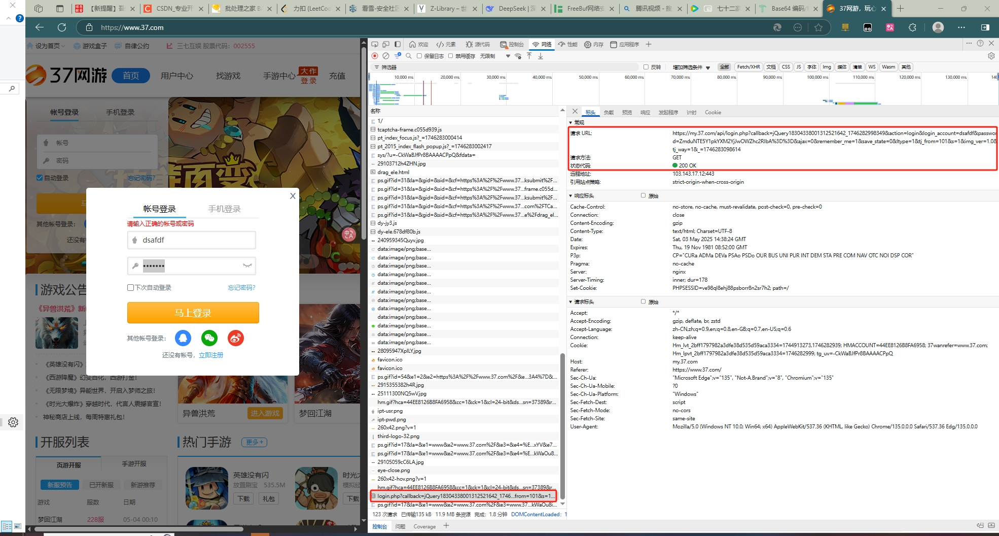
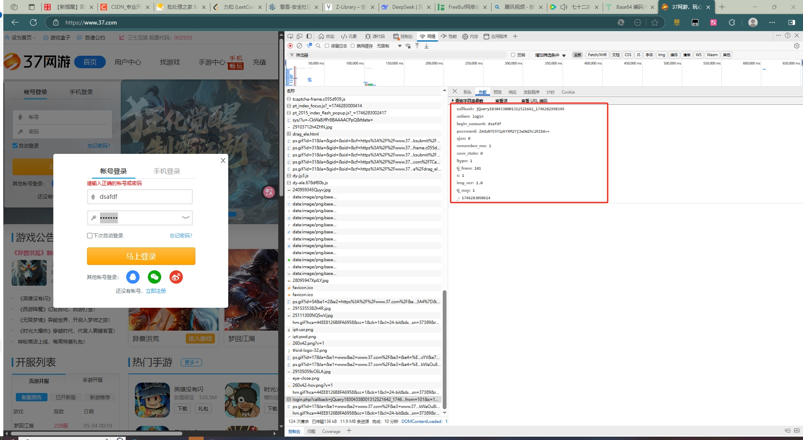
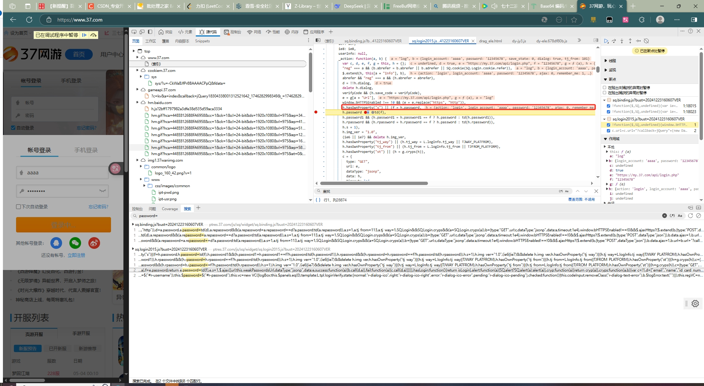
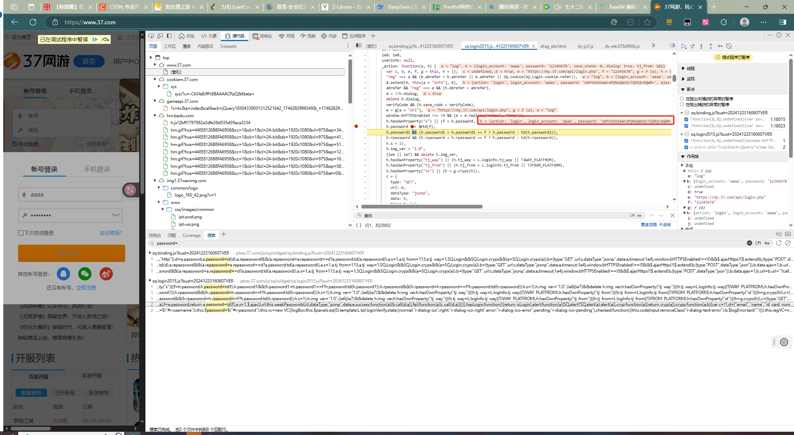
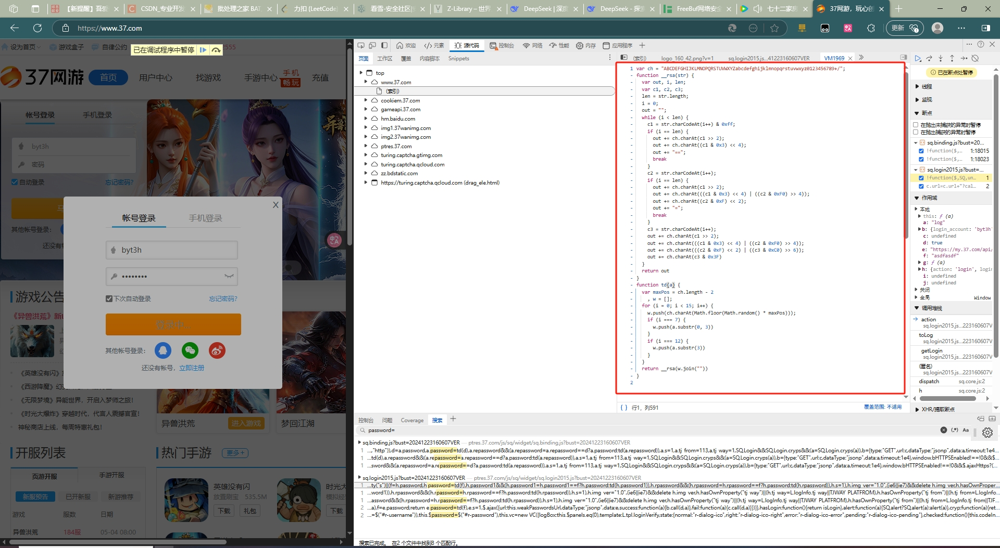
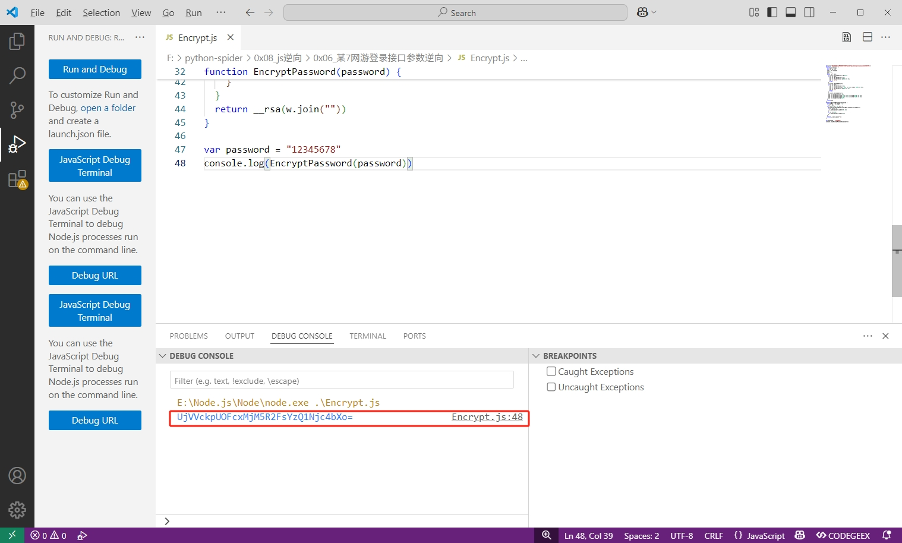
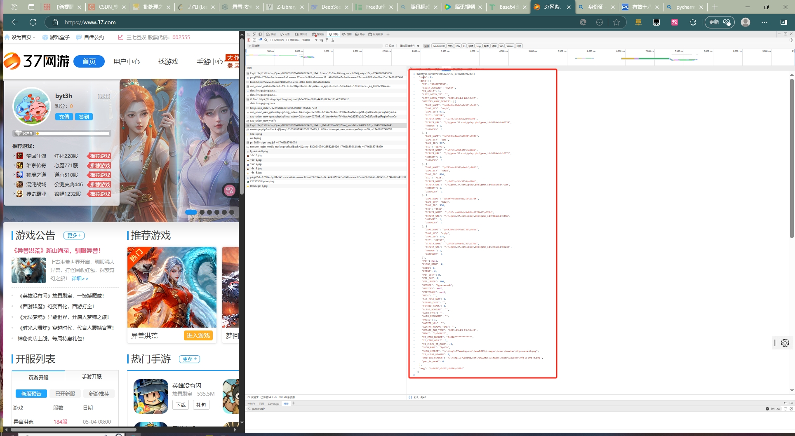
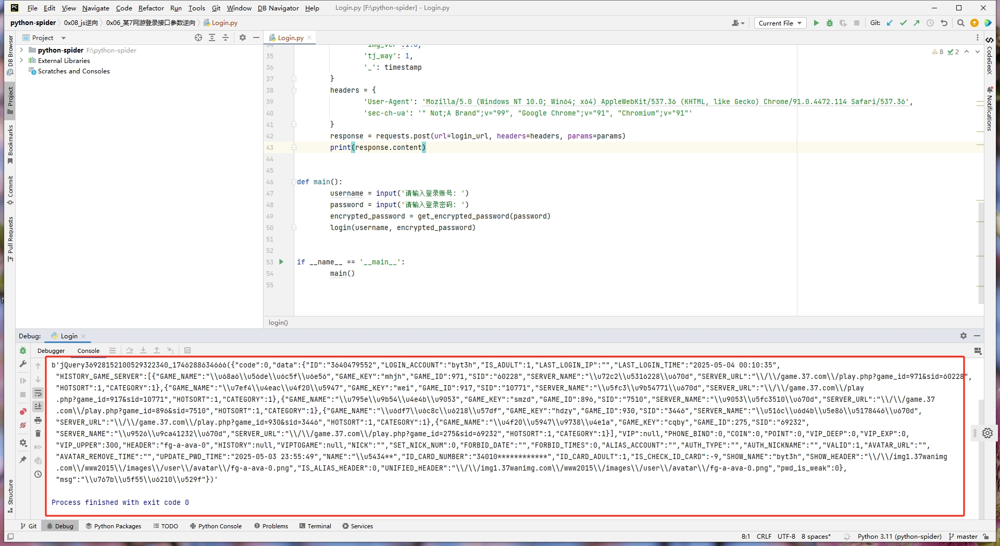
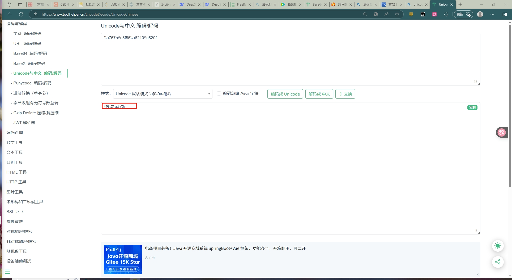

# 37网游登录

## 逆向目标

+ 目标：某 7 网游登录

+ 主页：<code>aHR0cHM6Ly93d3cuMzcuY29tLw==</code>

+ 接口：<code>aHR0cHM6Ly9teS4zNy5jb20vYXBpL2xvZ2luLnBocA==</code>

+ 逆向参数：<code>Query String Parameters：`password: SlVEOThrcjgzNDNjaUYxOTQzNDM0e`</code>

## 逆向分析

### 抓包分析

来到某 7 网游首页，随便输入一个账号密码，点击登陆，抓包定位到登录接口为 aHR0cHM6Ly9teS4zNy5jb20vYXBpL2xvZ2luLnBocA== ，GET 请求:

分析一下 Query String Parameters 里的主要参数：

+ `callback` 是一个回调参数，这个参数的值不影响请求结果，它的格式为 `jQuery + 20位数字 + _ + 13位时间戳`，使用 Python 很容易构建：

~~~ python
import time
import random

timestamp = str(int(time.time() * 1000))
jsonp = ''
for _ in range(20):
    jsonp += str(random.randint(0, 9))
callback = 'jQuery' + jsonp + '_' + timestamp
print(callback)
~~~

+ `login_account` 是登录的账户名；
+ `password` 是加密后的密码；
+ `_` 是13位时间戳

### 参数逆向

需要我们逆向的参数就只有一个 `password`， 我们尝试直接全局搜索此关键字，会发现出来的结果非常多，不利于分析，这里就有一个小技巧，加个等号，搜索 `password=`，这样就极大地缩短了查找范围，当然也可以搜索 `password:`，也可以在关键字和符号之间加个空格，还可以搜索 `var password` 等，这些都是可以尝试的，要具体情况具体分析，一种没有结果就换另一种。

在本案例中，我们搜索 `password=`，在 sq.login2015.js 文件里可以看到语句 `h.password = td(f)`，疑似密码加密的地方，在此处埋下断点进行调试，可以看到返回的值确实是加密后的密码：

继续跟进 `td` 函数，可以看到是用到了一个自写的 RSA 加密，很简单明了，我们直接将其复制下来使用 Python 调用即可：

## js关键代码

~~~ javascript
var ch = "ABCDEFGHIJKLMNOPQRSTUVWXYZabcdefghijklmnopqrstuvwxyz0123456789+/";
function __rsa(str) {
  var out, i, len;
  var c1, c2, c3;
  len = str.length;
  i = 0;
  out = "";
  while (i < len) {
    c1 = str.charCodeAt(i++) & 0xff;
    if (i == len) {
      out += ch.charAt(c1 >> 2);
      out += ch.charAt((c1 & 0x3) << 4);
      out += "==";
      break
    }
    c2 = str.charCodeAt(i++);
    if (i == len) {
      out += ch.charAt(c1 >> 2);
      out += ch.charAt(((c1 & 0x3) << 4) | ((c2 & 0xF0) >> 4));
      out += ch.charAt((c2 & 0xF) << 2);
      out += "=";
      break
    }
    c3 = str.charCodeAt(i++);
    out += ch.charAt(c1 >> 2);
    out += ch.charAt(((c1 & 0x3) << 4) | ((c2 & 0xF0) >> 4));
    out += ch.charAt(((c2 & 0xF) << 2) | ((c3 & 0xC0) >> 6));
    out += ch.charAt(c3 & 0x3F)
  }
  return out
}
function EncryptPassword(password) {
  var maxPos = ch.length - 2
    , w = [];
  for (i = 0; i < 15; i++) {
    w.push(ch.charAt(Math.floor(Math.random() * maxPos)));
    if (i === 7) {
      w.push(password.substr(0, 3))
    }
    if (i === 12) {
      w.push(password.substr(3))
    }
  }
  return __rsa(w.join(""))
}

var password = "12345678"
console.log(EncryptPassword(password))
~~~

调试后，发现成功拿到加密的密码

## python登录关键代码

~~~ python
import time
import random
import execjs
import requests

login_url = 'https://my.37.com/api/login.php'

def get_encrypted_password(password):
        with open('Encrypt.js', 'r', encoding='utf-8') as f:
                www_37_js = f.read()
        encrypted_pwd = execjs.compile(www_37_js).call('EncryptPassword', password)
        return encrypted_pwd

def login(username, encrypted_password):
        timestamp = str(int(time.time() * 1000))
        jsonp = ''
        for _ in range(20):
                jsonp += str(random.randint(0, 9))
        callback = 'jQuery' + jsonp + '_' + timestamp
        params = {
                'callback': callback,
                'action': 'login',
                'login_account': username,
                'password': encrypted_password,
                'ajax': 0,
                'remember_me': 1,
                'save_state': 1,
                'ltype': 1,
                'tj_from': 101,
                's': 1,
                'img_ver':1.0,
                'tj_way': 1,
                '_': timestamp
        }
        headers = {
                'User-Agent': 'Mozilla/5.0 (Windows NT 10.0; Win64; x64) AppleWebKit/537.36 (KHTML, like Gecko) Chrome/91.0.4472.114 Safari/537.36',
                'sec-ch-ua': '" Not;A Brand";v="99", "Google Chrome";v="91", "Chromium";v="91"'
        }
        response = requests.post(url=login_url, headers=headers, params=params)
        print(response.content)

def main():
        username = input('请输入登录账号: ')
        password = input('请输入登录密码: ')
        encrypted_password = get_encrypted_password(password)
        login(username, encrypted_password)

if __name__ == '__main__':
        main()

~~~

运行代码后，发现成功登录

