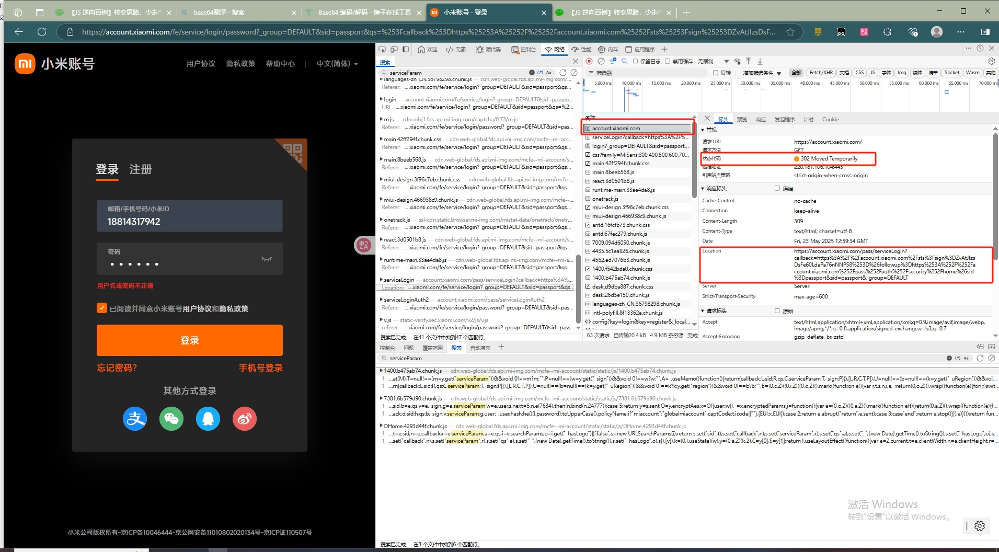

## 逆向目标

+ 目标：某米账号登录

+ 主页：aHR0cHM6Ly9hY2NvdW50LnhpYW9taS5jb20v
+ 接口：aHR0cHM6Ly9hY2NvdW50LnhpYW9taS5jb20vcGFzcy9zZXJ2aWNlTG9naW5BdXRoMg==

+ 逆向参数：Form Data:<code>hash:A5CF6D92A2E2EA2527E04E180C103AA6</code>

## 抓包分析

来到X米的登录页面，随便输入一个账号密码登陆，抓包定位到登录接口为<code>aHR0cHM6Ly9hY2NvdW50LnhpYW9taS5jb20vcGFzcy9zZXJ2aWNlTG9naW5BdXRoMg==</code>

POST 请求，Form Data 里的参数比较多，分析一下主要参数：

+ **serviceParam**: `{"checkSafePhone":false,"checkSafeAddress":false,"lsrp_score":0.0}`，从参数的字面意思来看，似乎是在检查手机和地址是否安全，至于具体是什么含义，暂时不得而知，也不知道是在哪个地方设置的。
+ **callback**: `https://account.xiaomi.com/sts?sign=ZvAtJIzsDsFe60LdaPa76nNNP58%3D&followup=https%3A%2F%2Faccount.xiaomi.com%2Fpass%2Fauth%2Fsecurity%2Fhome&sid=passport`，回调链接，一般来说是固定的，后面带有 followup 和 sid 参数。
+ **qs**: `%3Fcallback%3Dhttps%253A%252F%252Faccount.xiaomi.com%252Fsts%253Fsign%253DZvAtJIzsDsFe60LdaPa76nNNP58%25253D%2526followup%253Dhttps%25253A%25252F%25252Faccount.xiaomi.com%25252Fpass%25252Fauth%25252Fsecurity%25252Fhome%2526sid%253Dpassport%26sid%3Dpassport%26_group%3DDEFAULT`，把 qs 的值格式化一下可以发现，其实是 callback、sign、sid、_qrsize 四个值按照 URL 编码进行组合得到的。
+ **_sign**: `2&V1_passport&BUcblfwZ4tX84axhVUaw8t6yi2E=`，这个一串看起来是经过某种加密后得到的，也有可能是网页源码中的值。
+ **user**: `k5PbpD4SbVHewBnjYF2ijQ==`，加密后的用户名
+ **hash**: `FCEA920F7412B5DA7BE0CF42B8C93759`，加密后的密码。

## 参数逆向

### 基本参数

先来看一下 `serviceParam` 等基本参数，一般思路我们是先直接搜索一下看看能不能直接找到这个值，搜索发现 `serviceParam` 关键字在一个 302 重定向请求里：

我们注意到，当只输入登录的主页 aHR0cHM6Ly9hY2NvdW50LnhpYW9taS5jb20v，它会有两次连续的 302 重定向，来重点分析一下这两次重定向。

第一次重定向，新的网址里有 `followup`、`callback`、`sign`、`sid` 参数，这些我们都是在后面的登录请求中要用到的。

第二次重定向，新的网址里同样有 `followup`、`callback`、`sign`、`sid` 参数，此外还有 `serviceParam`、`qs` 参数，同样也是后面的登录请求需要用到的。

找到了参数的来源，直接从第二次重定向的链接里提取各项参数，这里用到了 `response.history[1].headers['Location']` 来提取页面第二次重定向返回头里的目标地址，`urllib.parse.urlparse` 来解析重定向链接 URL 的结构，`urllib.parse.parse_qs` 提取参数，返回字典，代码样例：

~~~ python
import requests
import urllib.parse

headers = {
    'Host': 'account.xiaomi.com',
    'User-Agent': 'Mozilla/5.0 (Windows NT 10.0; Win64; x64) AppleWebKit/537.36 (KHTML, like Gecko) Chrome/136.0.0.0 Safari/537.36 Edg/136.0.0.0'
}
index_url = 'https://account.xiaomi.com/'
response = requests.get(url=index_url, headers=headers)
location_url = response.history[1].headers['Location']
urlparse = urllib.parse.urlparse(location_url)
query_dict  = urllib.parse.parse_qs(urlparse.query)

need_theme = query_dict['needTheme'][0]
show_active_x = query_dict['showActiveX'][0]
service_param = query_dict['serviceParam'][0]
callback = query_dict['callback'][0]
qs = query_dict['qs'][0]
sid = query_dict['sid'][0]
_sign = query_dict['_sign'][0]
~~~

### hash

其他参数都齐全了，现在还差一个加密后的密码 hash，一般来讲这种都是通过 JS 加密的，老方法，全局搜索 `hash` 或者 `hash:`，可以在 `2395.f58d7844.chunk.js` 文件里面看到有一句：` hash: v()(i.password).toUpperCase()`，很明显是将明文的密码经过加密处理后再全部转为大写：

在这里打上断点后发现重点是这个 S()，鼠标移上去会发现其实是调用了 `runtime-main.33ae4da8.js` 的一个匿名函数，我们在匿名函数的 return 位置埋下断点进行调试：

最终定位到这个函数：

实际是下面这个函数：

~~~ javascript
e.exports = function(e, n) {
    if (void 0 === e || null === e)
        throw new Error("Illegal argument " + e);
    var r = t.wordsToBytes(u(e, n));
    return n && n.asBytes ? r : n && n.asString ? s.bytesToString(r) : t.bytesToHex(r)
}
~~~

可以看到传进来的 e 是明文的密码，最后的 return 语句是一个三目运算符，由于 n 是 undefined，所以最后 return 的实际上是 `t.bytesToHex(r)`，其值正是加密后的密码，只不过所有字母都是小写，按照正常思维，我们肯定是开始扣 JS 了，这里传入了参数 r，`var r = t.wordsToBytes(u(e, n));`，先跟进 u 这个函数看看：

可以看到 u 函数比较复杂，挨个去扣比较麻烦而且还容易出错并且代码太多也不好定位错误的地方，所以这里需要转变一下思路，先来看看 `t.bytesToHex(r)` 是个什么东西，跟进到这个函数：

~~~ javascript
 bytesToHex: function(e) {
          for (var t = [], n = 0; n < e.length; n++)
            t.push((e[n] >>> 4).toString(16)),
            t.push((15 & e[n]).toString(16));
          return t.join("")
        },
~~~

解读一下这段代码，传进来的 e 是一个 16 位的 Array 对象，定义了一个 t 空数组，经过一个循环，依次取 Array 对象里的值，第一次经过无符号右移运算（>>>）后，转为十六进制的字符串，将结果添加到 t 数组的末尾。第二次进行位运算（&）后，同样转为十六进制的字符串，将结果添加到 t 数组的末尾。也就是说，原本传进来的 16 位的 Array 对象，每一个值都经过了两次操作，那么最后结果的 t 数组中就会有 32 个值，最后再将 t 数组转换成字符串返回。

结合一下调用的函数名称，我们来捋一下整个流程，首先调用 `wordsToBytes()` 方法将明文密码字符串转为 byte 数组，无论密码的长度如何，最后得到的 byte 数组都是 16 位的，然后调用 `bytesToHex()` 方法，循环遍历生成的 byte 类型数组，让其生成 32 位字符串。

无论密码长度如何，最终得到的密文都是 32 位的，而且都由字母和数字组成，这些特点很容易让人想到 MD5 加密，将明文转换成 byte 数组后进行随机哈希，对 byte 数组进行摘要，得到摘要 byte 数组，循环遍历 byte 数组，生成固定位数的字符串，这不就是 MD5 的加密过程么？

直接把密码拿来进行 MD5 加密，和网站的加密结果进行对比，可以发现确实是一样的，验证了猜想是正确的：

既然如此，直接可以使用 Python 的 hashlib 模块来实现就 OK 了，根本不需要去死扣代码，代码样例：

~~~ python
import hashlib

password = "647561"
encrypted_password = hashlib.md5(password.encode(encoding='utf-8')).hexdigest().upper()
print(encrypted_password)
~~~

### user参数加密

​	从找到密码加密的地方发现，参数`user `已经被加密了，稍微往上追溯，找到了加密的点

加密函数如图

~~~ javascript
    function yt(t) {
      t = t || {};
      var e = function(t) {
        for (var e = "ABCDEFGHIJKLMNOPQRSTUVWXYZabcdefghijklmnopqrstuvwxyz0123456789!@#$%^&*", i = "", r = 0; r < t; r++) {
          var n = Math.floor(Math.random() * e.length);
          i += e.substring(n, n + 1)
        }
        return i
      }(16)
        , i = new gt({});
      i.setPublicKey("MIGfMA0GCSqGSIb3DQEBAQUAA4GNADCBiQKBgQCYEVrK/4Mahiv0pUJgTybx4J9P5dUT/Y0PuwMbk+gMU+jrZnBiXGv6/hCH1avIhoBcE535F8nJQQN3UavZdFkYidsoXuEnat3+eVTp3FslyhRwIBDF09v4vDhRtxFOT+R7uH7h/mzmyA2/+lfIMWGIrffXprYizbV76+YQKhoqFQIDAQAB");
      var r = i.encrypt(window.btoa(e))
        , s = o().parse("0102030405060708")
        , h = o().parse(e)
        , u = window.btoa(Object.keys(t).join(","))
        , c = {};
      return Object.keys(t).forEach((function(e) {
        var i = t[e]
          , r = n().encrypt(i, h, {
          iv: s,
          padding: a()
        });
        r = r.toString(),
        c[e] = r
      }
      )),
      {
        EUI: "".concat(r, ".").concat(u),
        encryptedParams: c
      }
    }
~~~

稍微更改一下形式

~~~ javascript
window = global;
const JSEncrypt = require('jsencrypt'); //暂时不知道为啥要导入这个库
const CryptoJS = require('crypto-js'); //暂时不知道为啥要导入这个库

function EncryptParams(t) {
    t = t || {};
    var e = function(t) {
      for (var e = "ABCDEFGHIJKLMNOPQRSTUVWXYZabcdefghijklmnopqrstuvwxyz0123456789!@#$%^&*", i = "", r = 0; r < t; r++) {
        var n = Math.floor(Math.random() * e.length);
        i += e.substring(n, n + 1)
      }
      return i
    }(16)
      , i = new JSEncrypt({}); //不知道为啥要用JSEncrypt
    i.setPublicKey("MIGfMA0GCSqGSIb3DQEBAQUAA4GNADCBiQKBgQCYEVrK/4Mahiv0pUJgTybx4J9P5dUT/Y0PuwMbk+gMU+jrZnBiXGv6/hCH1avIhoBcE535F8nJQQN3UavZdFkYidsoXuEnat3+eVTp3FslyhRwIBDF09v4vDhRtxFOT+R7uH7h/mzmyA2/+lfIMWGIrffXprYizbV76+YQKhoqFQIDAQAB");
    var r = i.encrypt(window.btoa(e))
      , s = CryptoJS.enc.Utf8.parse("0102030405060708") //不知道为啥要用CryptoJS.enc.Utf8
      , h = CryptoJS.enc.Utf8.parse(e) //不知道为啥要用CryptoJS.enc.Utf8
      , u = window.btoa(Object.keys(t).join(","))
      , c = {};
    return Object.keys(t).forEach((function(e) {
      var i = t[e]
        , r = CryptoJS.AES.encrypt(i, h, {
        iv: s,
        padding: CryptoJS.pad.Pkcs7 //这里的padding暂时不知道为啥要这样写
      });
      r = r.toString(),
      c[e] = r
    }
    )),
    {
      EUI: "".concat(r, ".").concat(u),
      encryptedParams: c
    }
  }
  
  const user = "18814317942"
  const EncryptParam = EncryptParams({
      "user":user 
    })
 console.log(EncryptParam)
 console.log("EUI:" + EncryptParam.EUI)
 console.log("EncryptedParams:" + EncryptParam.encryptedParams["user"])
~~~

如此即可成功加密得到参数

## 登录代码

如下：

~~~ python
import requests
import urllib.parse
import hashlib
import execjs

def get_encrypted_params(user):
        with open('EasyEncrpyt.js', 'r', encoding='utf-8') as f:
                www_xiaomiaccount_js = f.read()
        encrypted_params = execjs.compile(www_xiaomiaccount_js).call('EncryptParams', {"user":user})
        return encrypted_params

def Login(user,password):
    headers = {
        'Host': 'account.xiaomi.com',
        'User-Agent': 'Mozilla/5.0 (Windows NT 10.0; Win64; x64) AppleWebKit/537.36 (KHTML, like Gecko) Chrome/136.0.0.0 Safari/537.36 Edg/136.0.0.0',
    }

    index_url = 'https://account.xiaomi.com/'
    response = requests.get(url=index_url, headers=headers)
    location_url = response.history[1].headers['Location']
    referer = location_url.replace("https://account.xiaomi.com/fe/service/login","https://account.xiaomi.com/fe/service/login/password") + "&_locale=zh_CN"
    cookie = response.history[1].headers['set-cookie'].split(";")[0] + ";pass_ua=web; uLocale=zh_CN; passInfo=login-end;"
    cookies = {
        "deviceId": response.history[1].headers['set-cookie'].split(";")[0],
        "pass_ua":"web",
        "uLocale":"zh_CN",
        "passInfo":"login-end"
    }
    urlparse = urllib.parse.urlparse(location_url)
    query_dict  = urllib.parse.parse_qs(urlparse.query)

    EncryptParams = get_encrypted_params(user)
    user = EncryptParams["encryptedParams"]["user"]

    encrypted_password = hashlib.md5(password.encode(encoding='utf-8')).hexdigest().upper()

    data = {
        "bizDeviceType": '',
        "need_theme": query_dict['needTheme'][0],
        "theme": '',
        "show_active_x":query_dict['showActiveX'][0],
        "service_param": query_dict['serviceParam'][0],
        "callback": query_dict['callback'][0],
        "qs": query_dict['qs'][0],
        "sid": query_dict['sid'][0],
        "_sign": query_dict['_sign'][0],
        "user": user,
        'cc': '+86',
        "password": encrypted_password,
        '_json': True,
        "policyName": "miaccount",
        "captCode": ""
    }

    login_url = "https://account.xiaomi.com/pass/serviceLoginAuth2"

    login_headers = {
        "Accept":"application/json, text/plain, */*",
        "Accept-Encoding": "gzip,deflate,br,zstd",
        "Accept-Language": "zh-CN,zh;q=0.9,en;q=0.8,en-GB;q=0.7,en-US;q=0.6",
        "Connection":"keep-alive",
        "Content-Length": "878",
        'Host': 'account.xiaomi.com',
        "Origin":"https://account.xiaomi.com",
        "EUI": EncryptParams["EUI"],
        "Referer":referer,
        "Cookie":cookie,
        "sec-ch-ua":'"Chromium";v="136", "Microsoft Edge";v="136", "Not.A/Brand";v="99"',
        "sec-ch-ua-mobile":"?0",
        "sec-ch-ua-platform":'"Windows"',
        "sec-fetch-dest":"empty",
        "sec-fetch-mode":"cors",
        "sec-fetch-site":"same-origin",
        'User-Agent': 'Mozilla/5.0 (Windows NT 10.0; Win64; x64) AppleWebKit/537.36 (KHTML, like Gecko) Chrome/136.0.0.0 Safari/537.36 Edg/136.0.0.0',
        "x-requested-with":"XMLHttpRequest"
    }
    login_headers["Content-Length"] = "880"

    response = requests.session().post(url=login_url, headers=login_headers,cookies=cookies, data=data)
    print(response.text)

user  = input("请输入账号：")
password = input("请输入密码：")
Login(user, password)

~~~

<code>EasyEncrpyt.js</code>

~~~ javascript
window = global;
const JSEncrypt = require('jsencrypt'); //暂时不知道为啥要导入这个库
const CryptoJS = require('crypto-js'); //暂时不知道为啥要导入这个库

function EncryptParams(t) {
    t = t || {};
    var e = function(t) {
      for (var e = "ABCDEFGHIJKLMNOPQRSTUVWXYZabcdefghijklmnopqrstuvwxyz0123456789!@#$%^&*", i = "", r = 0; r < t; r++) {
        var n = Math.floor(Math.random() * e.length);
        i += e.substring(n, n + 1)
      }
      return i
    }(16)
      , i = new JSEncrypt({}); //不知道为啥要用JSEncrypt
    i.setPublicKey("MIGfMA0GCSqGSIb3DQEBAQUAA4GNADCBiQKBgQCYEVrK/4Mahiv0pUJgTybx4J9P5dUT/Y0PuwMbk+gMU+jrZnBiXGv6/hCH1avIhoBcE535F8nJQQN3UavZdFkYidsoXuEnat3+eVTp3FslyhRwIBDF09v4vDhRtxFOT+R7uH7h/mzmyA2/+lfIMWGIrffXprYizbV76+YQKhoqFQIDAQAB");
    var r = i.encrypt(window.btoa(e))
      , s = CryptoJS.enc.Utf8.parse("0102030405060708") //不知道为啥要用CryptoJS.enc.Utf8
      , h = CryptoJS.enc.Utf8.parse(e) //不知道为啥要用CryptoJS.enc.Utf8
      , u = window.btoa(Object.keys(t).join(","))
      , c = {};
    return Object.keys(t).forEach((function(e) {
      var i = t[e]
        , r = CryptoJS.AES.encrypt(i, h, {
        iv: s,
        padding: CryptoJS.pad.Pkcs7 //这里的padding暂时不知道为啥要这样写
      });
      r = r.toString(),
      c[e] = r
    }
    )),
    {
      EUI: "".concat(r, ".").concat(u),
      encryptedParams: c
    }
  }
  
  const user = "18814317942"
  const EncryptParam = EncryptParams({
      "user":user 
    })
 console.log(EncryptParam)
 console.log("EUI:" + EncryptParam.EUI)
 console.log("EncryptedParams:" + EncryptParam.encryptedParams["user"])
~~~

## 总结

有的时候需要我们转变思路，不一定每次都要死扣 JS 代码，相对较容易的站点的加密方式无非就是那么几种，有的是稍微进行了改写，有的是把密钥、偏移量等参数隐藏了，有的是把加密解密过程给你混淆了，让你难以理解，如果你对常见的加密方式和原理比较熟悉的话，有时候只需要搞清楚他用的什么加密方式，或者拿到了密钥、偏移量等关键参数，就完全可以自己还原整个加密过程！

## 结果

不知道为啥，输入正确的账号密码却提示验证失败。。。难受

## 参考链接

[某米商城登录逆向，user，hash 参数解密_小米登录 逆向](https://blog.csdn.net/Yy_Rose/article/details/125767465?ops_request_misc=%7B%22request%5Fid%22%3A%22c7a2f280a6ef798490057b66f9332356%22%2C%22scm%22%3A%2220140713.130102334..%22%7D&request_id=c7a2f280a6ef798490057b66f9332356&biz_id=0&utm_medium=distribute.pc_search_result.none-task-blog-2~all~sobaiduend~default-1-125767465-null-null.142^v102^pc_search_result_base9&utm_term=某米商城&spm=1018.2226.3001.4187)