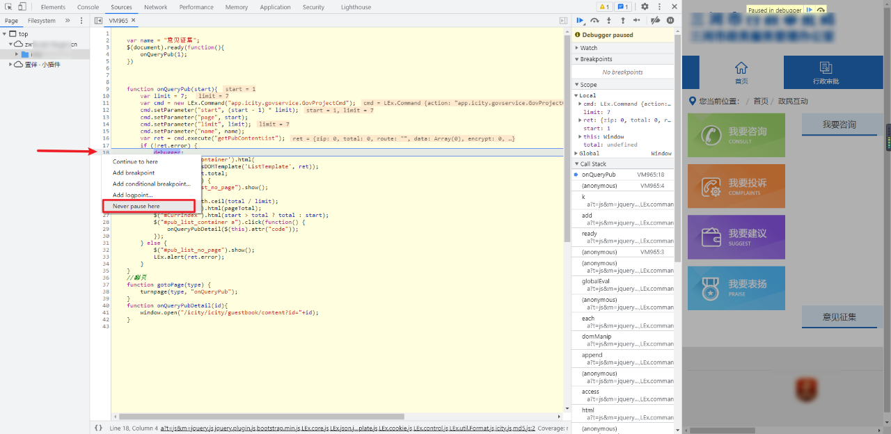

## 绕过无限debugger的方法

### 1、debugger的介绍

> debugger 是JavaScript中定义的一个专门用于断点调试的关键字，只要遇到它，JavaScript的执行便会在此处中断，进入一种调试模式。有了 debugger 这个关键字，该 debugger 会被网站开发者利用，使其成为我们正常调试的拦截手段

> 我们尝试抓包，打开开发者工具，刷新一下页面，会发现此时页面被断到 debugger 的位置，点击下一步，又会被断到另一个 debugger 的位置，这种情况就是无限 debugger，无限 debugger 存在的意义就是防止一部分人进行调试，但事实上绕过无限 debugger 的方法非常简单，方法也非常多，以下介绍常用的几种绕过方法。

### 2、无限debugger的绕过方法

#### 1、Never pause here

我们尝试抓包，打开开发者工具，刷新一下页面，会发现此时页面被断到 debugger 的位置，点击下一步，又会被断到另一个 debugger 的位置，这种情况就是无限 debugger，无限 debugger 存在的意义就是防止一部分人进行调试，但事实上绕过无限 debugger 的方法非常简单，方法也非常多，以下介绍常用的几种绕过方法。

#### 2、Add conditional breakpoint

同样右键选择 Add conditional breakpoint，输入 false 即可跳过无限 debugger，其原理是添加条件断点，不管前面代码的逻辑是什么，运行到 debugger 的时候必定是 true 才能执行，只需要将其改为 false，那么它就不执行了：

#### 3、方法置空

同样右键选择 Add conditional breakpoint，输入 false 即可跳过无限 debugger，其原理是添加条件断点，不管前面代码的逻辑是什么，运行到 debugger 的时候必定是 true 才能执行，只需要将其改为 false，那么它就不执行了：

#### 4、中间人拦截替换无限debug函数

所谓中间人拦截替换，就是狸猫换太子，将原来的含有无限 debugger 的函数给替换掉，这种方法适用于知道无限 debugger 函数所在的具体 JS 文件，重写 JS 文件，使其不含有无限 debugger 的函数，利用第三方工具将原来的 JS 文件替换成重写过后的文件，这类工具有很多，例如浏览器插件 ReRes，它通过指定规则，可以把请求映射到其他的 URL，也可以映射到本机的文件或者目录，抓包软件 Fidder 的 Auto responder 功能，也可以实现替换。

##### 用第三方工具fiddler解除无限debu

###### 实现原理

> 我们知道fiddler作为客户端和服务器的中间人，客户端向服务器发送请求以及服务器返回响应数据给客户端都要经过fiddler，因此我们就可以利用fiddler拦截服务器返回给客户端的JS文件，修改js文件中的debugger源码，然后在发送给客户端，这样就可以解决问题了

###### 操作方法

1、我们打开目标网站，进入开发者模式，点击上方的调试按钮，发现有两个js文件都出现了debugger，我们在文件空白处右键点击`save as` ，将两个文件都保存至本地

2. 找到保存的js文件，将它们通过记事本或文本文档打开

3. 打开两个js文件，搜索关键字 `debugger` ，将debugger相关的内容全部删除，然后 ctrl+s 保存退出

4. 我们将浏览器改为`系统代理`，打开`fiddler` 在 `自动响应`选项下，做如下步骤

可以在js文件空白处右键得到js文件的链接，复制到fiddler中，在导入本地修改好的文件，然后保存，两个js文件操作相同，演示如下：

5. 在`fiddler`中添加完规则后，返回浏览器，重新点击`系统代理`发送请求，发现debugger已经消失，修改成功！！！

**注意：**
浏览器在运行过程中，不能关闭fiddler后台，否则规则会立即失效

#### 5、hook方法过无限VM文件debugger

网站的debugger到底是什么原理？

+ 首先，最简单的方法，在 debugger 位置，点击行号，右键 Never pause here，永远不在此处断下即可。但是这种方法就妄想通杀，显然是不大可能的，不然这种防护岂不是弄出来骗自己的。
+ 现在很多网站，这样处理是无法绕过的。例如常规的，可能存在格式化检测，内存爆破，禁用右键，要么就会接着进入到下一个 debugger 中，甚至出现网页卡死的情况等等。
  

##### VM虚拟机

> 首先，debugger都会进入一个vm的文件中，那么关于这个vm，是这样的
>
> ​	VM 表示的是 Virtual Machine(虚拟机)，这些文件通常表示由浏览器生成和执行的虚拟机脚本环境中的临时脚本。这些脚本并不是项目源代码的一部分，也不是实际存在的物理文件，它们在浏览器的内存中创建并执行。 
>
> ​	比如说，当你在调试一个网页时，如果在某些动态生成并执行的 JS 代码上设定了断点，Chrome 调试器会在一个以 VM 开头的文件中显示这些代码，例如 VM1057。这个 VM 文件的存在只是为了调试目的，它并不存在于服务器端，也不会被存储在本地，而是存在于浏览器内存中。
>
> ​	一般情况下，这类文件的出现是因为浏览器对 JavaScript 代码的处理方式，如动态编译或者 JavaScript 堆栈跟踪。出现的原因：
>
> ​	动态执行的 JavaScript 代码。比如通过 eval 函数或者 new Function 方法，Chrome 浏览器会创建一个 VM 文件来展示这段临时执行的代码。比如某个网页因为反爬虫，动态生成了 debugger，这些断点并没有直接写在服务器上的原始 JavaScript 文件中，而是在某些 JavaScript 代码的执行过程中被生成，并因此触发 debugger。这些代码也会在执行时被浏览器视为临时的 VM 脚本，并在执行到 debugger 时暂停执行，从而造成所谓的 无限 debugger 循环。
>
> ​	来自执行栈的代码。有时候，当 JavaScript 引擎处理异步操作(例如 Promise、setTimeout 等)中的错误时，错误堆栈可能包含到 VM 脚本的引用，这是因为内部错误回调函数是在虚拟环境中执行的。

##### 定时器debugger

###### setTimeout

可以看到这里是使用setTimeout定时器重复执行，并且.constructor执行debugger函数生成的无限debugger

，那么这种定时控制的函数我们直接hook掉它的方法或者定时器就可以

hook代码

~~~ javascript
// ==UserScript==
// @name         天气检测settimeouthook
// @namespace    http://tampermonkey.net/
// @version      2025-03-17
// @description  try to take over the world!
// @author       You
// @match        https://www.aqistudy.cn/*
// @icon         https://www.google.com/s2/favicons?sz=64&domain=aqistudy.cn
// @grant        none
// @run-at       document-start
// ==/UserScript==
// 两种 Hook 任选一中
// Hook 构造方法
Function.prototype.constructor_ = Function.prototype.constructor;
Function.prototype.constructor = function (a) {
    if(a == "debugger") {
        return function (){};
    }
    return Function.prototype.constructor_(a);
};

// Hook setTimeout
var setTimeout_ = setTimeout
var setTimeout = function (func, time){
    if (func == txsdefwsw){
        return function () {};
    }
    return setTimeout_(func, time)
}
~~~

###### setInterval

如果是setInterval 定时器和构造方法 constructor

~~~ javascript
// Hook setInterval
var setInterval_ = setInterval
setInterval = function (func, time){
    if (time == 2000) {
        return function () {};
    }
    return setInterval_(func, time)
}
~~~

###### hook constructor

~~~ javascript
Function.prototype.constructor_ = Function.prototype.constructor;
Function.prototype.constructor = function (a) {
    // 如果参数为 debugger，就返回空方法
    if(a == "debugger") {
        return function (){};
    }
    // 如果参数不为 debugger，还是返回原方法
    return Function.prototype.constructor_(a);
};

~~~

