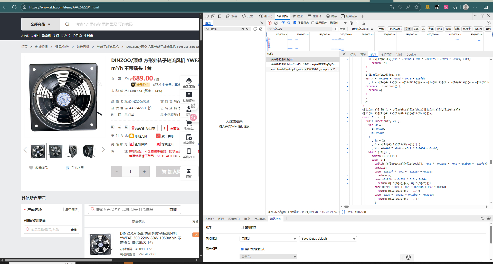
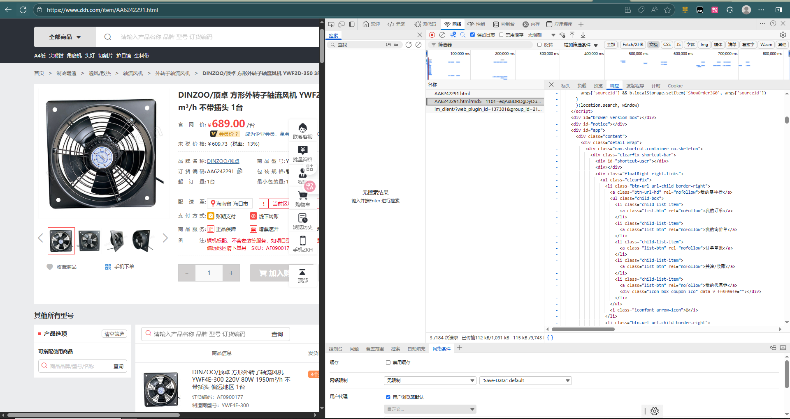

## **逆向目标**

+ 目标：`某坤行/某雪球/acw_sc__v2`

+ 网址：

  + `aHR0cHM6Ly93d3cuemtoLmNvbS9pdGVtL0FBNjI0MjI5MS5odG1s``
  + ``aHR0cHM6Ly94dWVxaXUuY29tLw==`

  + `aHR0cHM6Ly93d3cudGhmdW5kLmNvbS5jbi8=`

## 抓包分析

### 某坤行

首先访问详情页`https://www.zkh.com/item/AA6242291.html`，发现他会请求 2 次，第一次返回带混淆的 js 代码：

第二次请求，携带 `md5__1101` 参数即可返回正常的 html 内容：

### 某雪球

某雪球长串短串随机触发（大部分是长串），我们这里点击评论列表的小气泡图标，发起数据请求，其中载荷参数为主要分析对象：

(暂未搞到)

## **逆向分析**

### 某坤行

首先我们访问详情页，下脚本断点，发现他在 `VMxxx.html` 里成功断下，这里发现 href 暂未生成相关参数：

抓不到包啊。。。我服了

