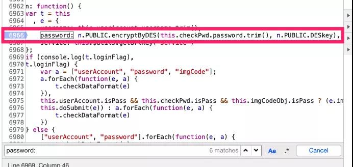

#实战案例浅析JS加密 - DES与Base64

##原创 煌金的咸鱼 咸鱼学Python 2019-04-26 18:31


###讲在前面

本篇旨在简单总结JS与Python加密的一些例子,文中演示的案例也是面向新手

###常用的加密有哪些？

+ 对称加密（加密解密密钥相同）：DES、DES3、AES
+ 非对称加密（分公钥私钥）：RSA
+ 信息摘要算法/签名算法：MD5、HMAC、SHA

学习资源推荐

冷月大佬的博客:[https://lengyue.me/](https://lengyue.me/)

崔庆才大佬的博客:[https://cuiqingcai.com/](https://cuiqingcai.com/)

突破前端反调试--阻止页面不断debugger :

[https://segmentfault.com/a/1190000012359015](https://segmentfault.com/a/1190000012359015)

岚光的JavaScript反调试和混淆 :

[https://0x0d.im/archives/javascript-anti-debug-and-obfuscator.html](https://0x0d.im/archives/javascript-anti-debug-and-obfuscator.html)

###常用调试流程

以下是可以参考的调试流程<b>(面向新手)</b>:   
       
1.如果网页有跳转，必须勾选 preservelog 防止丢包   
        
2.看一下有没有框架 右键查看框架源代码(弹出式登陆界面)  
        
3.登陆尽量使用错误密码 防止跳转          

4.查看关键登陆包 分析哪些参数是加密的            
   
5.使用别的浏览器分析哪些参数是固定的值           

6.初步猜测加密方法          

7.搜索

+ 直接搜索参数
+ pwd=
+ pwd =
+ pwd:
+ pwd :
+ 密码框地方右键 检查 查看 id name type

8.找到加密的地方(重点)

9.调试

10.出所有的加密代码

+ 从最后一步开始写起，缺啥找啥           
+ 如果找的是函数的话 search 要带上 function xxx      
+ 如果看到加密的地方有个类，并且之后是用 prototype 把方法加在原生对象上的话，要把所有加在原生对象上的方法都找出来          
+ 函数找多了没关系，只要不报错不会影响结果，但是不能找少了        

###DES加密

####JS调试实战案例

+ 为了避免被删文,所以这里就不说是哪个网站了,有需要可私信      
+ 先参照上面的调试流程抓包,搜索加密参数'password',经过测试通过'password='这关键字找到了加密所在的js。


+ 经过测试(步骤7)在文件内搜索'password:'找到加密位置,并通过断点确认了猜测。




+ 通过点击提示的路径,我们找到以下代码:


+ 找到这里就可以把需要的js代码扣出来,然后一步步调试了,通过补齐缺失的代码,得到以下js加密代码并运行:

	var CryptoJS = CryptoJS || function(u, l) {    var d = {}        , n = d.lib = {}        , p = function() {}        , s = n.Base = {        extend: function(a) {            p.prototype = this;            var c = new p;            a && c.mixIn(a);            c.hasOwnProperty("init") || (c.init = function() {                    c.$super.init.apply(this, arguments)                }            );            c.init.prototype = c;            c.$super = this;            return c        },        create: function() {            var a = this.extend();            a.init.apply(a, arguments);================ 代码太多了,此处省略 ================var encryptByDES = function(t) {    var e = "e9284d45-cf2a-4e46-9367-f122413ca6b0";    var a = CryptoJS.enc.Utf8.parse(e);    try {        var s = CryptoJS.DES.encrypt(String(t), a, {            mode: CryptoJS.mode.ECB,            padding: CryptoJS.pad.Pkcs7        })    } catch (t) {        console.log(t)    }    return s.toString()}console.log(encryptByDES('11111111111'))


输出运行结果'+g64648uhmWlN9eoU3Tszw==',与我们抓包的结果相同。


###Base64加密

####JS调试实战案例

+ 同样参照上面的调试流程,搜索加密参数'encodePassword',经过测试通过'encodePassword ='这关键字找到了加密所在的js,并通过断点验证


+ 找到关键加密位置后,查看加密的js文件,直接复制出来即可


+ base64加密比较简单,直接复制补上我们的密码,输出的就是加密后的字段了
	
	function Base64() {
	
	    // private property
	    _keyStr = "ABCDEFGHIJKLMNOPQRSTUVWXYZabcdefghijklmnopqrstuvwxyz0123456789+/=";
	
	    // public method for encoding
	    this.encode = function (input) {
	        var output = "";
	        var chr1, chr2, chr3, enc1, enc2, enc3, enc4;
	        var i = 0;
	        input = _utf8_encode(input);
	        while (i < input.length) {
	            chr1 = input.charCodeAt(i++);
	            chr2 = input.charCodeAt(i++);
	            chr3 = input.charCodeAt(i++);
	            enc1 = chr1 >> 2;
	            enc2 = ((chr1 & 3) << 4) | (chr2 >> 4);
	            enc3 = ((chr2 & 15) << 2) | (chr3 >> 6);
	
	================ 代码太多了,此处省略 ================
	
	var encodePassWord = new Base64().encode('11111111111')+",";
	console.log(encodePassWord)

###Python实现加密方法合集

其实上面的步骤不一定都要去手动扣JS, 我们的大Python已经为我们造好了轮子,如果可以判断js的加密没有做其他的更改,我们就可以使用造好的轮子直接实现对应的加密。

所以这里给大家推荐一个大佬写的加密代码合集(我就不献丑了),记得给大佬来个star
GitHub地址:

[https://github.com/dhfjcuff/R-A-M-D-D3-S-M-H/blob/master/RSA-AES-MD5-DES-DES3-MD5-SHA-HMAC.py](https://github.com/dhfjcuff/R-A-M-D-D3-S-M-H/blob/master/RSA-AES-MD5-DES-DES3-MD5-SHA-HMAC.py)

内容如下:
	
	# -*- coding：utf-8 -*-
	import base64
	import rsa
	from Crypto.Cipher import AES
	from Crypto.PublicKey import RSA
	from pyDes import des, CBC, PAD_PKCS5
	from Crypto.Cipher import DES3
	import hashlib
	import hmac
	
	
	class USE_AES:
	    """
	    AES
	    除了MODE_SIV模式key长度为：32, 48, or 64,
	    其余key长度为16, 24 or 32
	    详细见AES内部文档
	    CBC模式传入iv参数
	    本例使用常用的ECB模式
	    """
	
	    def __init__(self, key):
	        if len(key) > 32:
	            key = key[:32]
	        self.key = self.to_16(key)
	
	    def to_16(self, key):
	        """
	        转为16倍数的bytes数据
	        :param key:
	        :return:
	        """
	        key = bytes(key, encoding="utf8")
	        while len(key) % 16 != 0:
	            key += b'\0'
	        return key  # 返回bytes
	
	    def aes(self):
	        return AES.new(self.key, AES.MODE_ECB) # 初始化加密器
	
	    def encrypt(self, text):
	        aes = self.aes()
	        return str(base64.encodebytes(aes.encrypt(self.to_16(text))),
	                   encoding='utf8').replace('\n', '')  # 加密
	
	    def decodebytes(self, text):
	        aes = self.aes()
	        return str(aes.decrypt(base64.decodebytes(bytes(
	            text, encoding='utf8'))).rstrip(b'\0').decode("utf8"))  # 解密
	
	
	class USE_RSA:
	    """
	    生成密钥可保存.pem格式文件
	    1024位的证书，加密时最大支持117个字节，解密时为128；
	    2048位的证书，加密时最大支持245个字节，解密时为256。
	    加密大文件时需要先用AES或者DES加密，再用RSA加密密钥，详细见文档
	    文档:https://stuvel.eu/files/python-rsa-doc/usage.html#generating-keys
	    """
	    def __init__(self, number=1024):
	        """
	        :param number: 公钥、私钥
	        """
	        self.pubkey, self.privkey = rsa.newkeys(number)
	
	    def rsaEncrypt(self, text):
	        """
	        :param test: str
	        :return: bytes
	        """
	        content = text.encode('utf-8')
	        crypto = rsa.encrypt(content, self.pubkey)
	        return crypto
	
	    def rsaDecrypt(self, text):
	        """
	        :param text:bytes
	        :return: str
	        """
	        content = rsa.decrypt(text, self.privkey)
	        con = content.decode('utf-8')
	        return con
	
	    def savePem(self, path_name, text):
	        """
	        :param path_name: 保存路径
	        :param text: str
	        :return:bytes
	        """
	        if "PEM" in path_name.upper():
	            path_name = path_name[:-4]
	        with open('{}.pem'.format(path_name), 'bw') as f:
	            f.write(text.save_pkcs1())
	
	    def readPem(self, path_name, key_type):
	        """
	        :param path_name: 密钥文件
	        :param key_type:类型
	        :return:
	        """
	        if 'pubkey' in key_type:
	            self.pubkey = rsa.PublicKey.load_pkcs1(path_name)
	        else:
	            self.privkey = rsa.PublicKey.load_pkcs1(path_name)
	        return True
	
	    def sign(self, message, priv_key=None, hash_method='SHA-1'):
	        """
	        生成明文的哈希签名以便还原后对照
	        :param message: str
	        :param priv_key:
	        :param hash_method: 哈希的模式
	        :return:
	        """
	        if None == priv_key:
	            priv_key = self.privkey
	        return rsa.sign(message.encode(), priv_key, hash_method)
	
	    def checkSign(self, mess, result, pubkey=None):
	        """
	        验证签名：传入解密后明文、签名、公钥，验证成功返回哈希方法，失败则报错
	        :param mess: str
	        :param result: bytes
	        :param pubkey:
	        :return: str
	        """
	        if None == pubkey:
	            pubkey = self.privkey
	        try:
	            result = rsa.verify(mess, result, pubkey)
	            return result
	        except:
	            return False
	
	
	class USE_DES:
	    """
	    des(key,[mode], [IV], [pad], [pad mode])
	    key:必须正好8字节
	    mode（模式）：ECB、CBC
	    iv:CBC模式中必须提供长8字节
	    pad:填充字符
	    padmode:加密填充模式PAD_NORMAL or PAD_PKCS5
	    """
	    def __init__(self, key, iv):
	        if not isinstance(key, bytes):
	            key = bytes(key, encoding="utf8")
	        if not isinstance(iv, bytes):
	            iv = bytes(iv, encoding="utf8")
	        self.key = key
	        self.iv = iv
	
	    def encrypt(self, text):
	        """
	        DES 加密
	        :param text: 原始字符串
	        :return: 加密后字符串，bytes
	        """
	        if not isinstance(text, bytes):
	            text = bytes(text, "utf-8")
	        secret_key = self.key
	        iv = self.iv
	        k = des(secret_key, CBC, iv, pad=None, padmode=PAD_PKCS5)
	        en = k.encrypt(text, padmode=PAD_PKCS5)
	        return en
	
	    def descrypt(self, text):
	        """
	        DES 解密
	        :param text: 加密后的字符串，bytes
	        :return:  解密后的字符串
	        """
	        secret_key = self.key
	        iv = self.iv
	        k = des(secret_key, CBC, iv, pad=None, padmode=PAD_PKCS5)
	        de = k.decrypt(text, padmode=PAD_PKCS5)
	        return de.decode()
	
	
	class USE_DES3:
	    """
	    new(key, mode, *args, **kwargs)
	    key:必须8bytes倍数介于16-24
	    mode：
	    iv:初始化向量适用于MODE_CBC、MODE_CFB、MODE_OFB、MODE_OPENPGP，4种模式
	        ``MODE_CBC``, ``MODE_CFB``, and ``MODE_OFB``长度为8bytes
	        ```MODE_OPENPGP```加密时8bytes解密时10bytes
	        未提供默认随机生成
	    nonce：仅在 ``MODE_EAX`` and ``MODE_CTR``模式中使用
	            ``MODE_EAX``建议16bytes
	            ``MODE_CTR``建议[0, 7]长度
	            未提供则随机生成
	    segment_size：分段大小，仅在 ``MODE_CFB``模式中使用，长度为8倍数，未指定则默认为8
	    mac_len：适用``MODE_EAX``模式，身份验证标记的长度（字节），它不能超过8（默认值）
	    initial_value：适用```MODE_CTR```，计数器的初始值计数器块。默认为**0**。
	    """
	    def __init__(self, key):
	        self.key = key
	        self.mode = DES3.MODE_ECB
	
	    def encrypt(self, text):
	        """
	        传入明文
	        :param text:bytes类型，长度是KEY的倍数
	        :return:
	        """
	        if not isinstance(text, bytes):
	            text = bytes(text, 'utf-8')
	        x = len(text) % 8
	        text = text+b'\0'*x
	        cryptor = DES3.new(self.key, self.mode)
	        ciphertext = cryptor.encrypt(text)
	        return ciphertext
	
	    def decrypt(self, text):
	        cryptor = DES3.new(self.key, self.mode)
	        plain_text = cryptor.decrypt(text)
	        st = str(plain_text.decode("utf-8")).rstrip('\0')
	        return st
	
	
	def USE_MD5(test):
	    if not isinstance(test, bytes):
	        test = bytes(test, 'utf-8')
	    m = hashlib.md5()
	    m.update(test)
	    return m.hexdigest()
	
	
	def USE_HMAC(key, text):
	    if not isinstance(key, bytes):
	        key = bytes(key, 'utf-8')
	    if not isinstance(text, bytes):
	        text = bytes(text, 'utf-8')
	    h = hmac.new(key, text, digestmod='MD5')
	    return h.hexdigest()
	
	
	def USE_SHA(text):
	    if not isinstance(text, bytes):
	        text = bytes(text, 'utf-8')
	    sha = hashlib.sha1(text)
	    encrypts = sha.hexdigest()
	    return encrypts
	
	
	if __name__ == '__main__':
	    aes_test = USE_AES("assssssssdfasasasasa")
	    a = aes_test.encrypt("测试")
	    b = aes_test.decodebytes(a)
	    rsa_test = USE_RSA()
	    a = rsa_test.rsaEncrypt("测试加密")
	    b = rsa_test.rsaDecrypt(a)
	    des_test = USE_DES(b"12345678", b"12345678")
	    a = des_test.encrypt("测试加密")
	    b = des_test.descrypt(a)
	    des3_test = USE_DES3(b"123456789qazxswe")
	    a = des3_test.encrypt("测试加密")
	    b = des3_test.decrypt(a)
	    md5_test = USE_MD5("测试签名")
	    hmac_test = USE_HMAC("123456", "测试")
	    sha_test = USE_SHA("测试加密")

###小结

本文简单介绍了关于JS调试加密字段的流程,并且分别调试了关于DES与Base64加密的两个案例。

文中举例的案例属于菜鸟级别,但是千万因为这样就小瞧JS逆向这门学问,因为上面写的案例其实连js逆向入门的门槛都没跨过。
